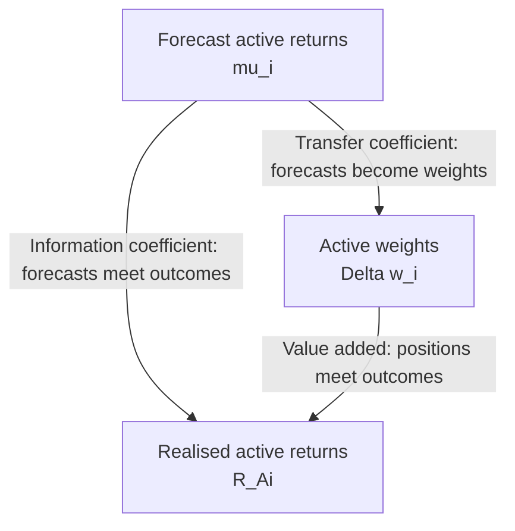
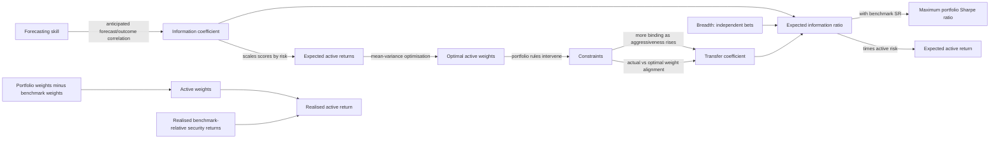

1. Active management starts with a claim: the manager can predict some returns better than the market has already priced them. Mean–variance theory then asks the less glamorous question - how should those forecasts become weights when risk, a benchmark, and constraints exist?

2. An active manager does not create value merely by earning a positive return. If the benchmark earns more, the manager destroyed relative value. The relevant counterfactual is the passive portfolio the client could have held cheaply.

3. Positive active return means outperformance. Negative active return means the benchmark would have been the better choice over the measurement period, especially after fees and costs.

4. A useful benchmark must satisfy three conditions:
	1. **Representative:** it contains the opportunity set from which the manager is supposed to select.
	2. **Replicable at low cost:** passive ownership must be a real alternative, not a theoretical ghost portfolio.
	3. **Observable:** weights are verifiable ex ante and returns arrive promptly ex post.

5. Capitalisation-weighted indexes are common because they are largely self-rebalancing and can be held simultaneously by investors. Float adjustment improves investability by excluding shares unavailable to the public.

6. If a float-adjusted capitalisation-weighted benchmark covers the whole relevant market, active management ==is a **zero-sum game before costs**: all investors together own the market, so one investor's positive active return is another's negative active return.== With a narrower benchmark, managers may hold assets outside it, so the same zero-sum statement need not hold relative to that narrower index.

7. Before value added can be measured, both portfolios must be built from the same primitive: security weights multiplied by security returns.

$$
\underbrace{R_B}_{\text{benchmark return}}
=
\underbrace{\sum_{i=1}^{N}}_{\text{sum across all }N\text{ assets}}  
\left(  
\underbrace{w_{B,i}}_{\substack{\text{benchmark weight}\text{ of asset }i}}  
\quad
\underbrace{R_i}_{\substack{\text{return}\text{ of asset }i}}  
\right)  
\tag{1}  
$$

The benchmark return is the sum of each asset’s return weighted by its proportion in the benchmark.

$$
\underbrace{R_P}_{\text{portfolio return}}
=
\underbrace{\sum_{i=1}^{N}}_{\text{sum across all }N\text{ assets}}
\left(
\underbrace{w_{P,i}}_{\substack{\text{portfolio weight}\\\text{of asset }i}}
\;
\underbrace{R_i}_{\substack{\text{return}\\\text{of asset }i}}
\right)
\tag{2}
$$

Each asset’s return is multiplied by its portfolio weight, and these weighted returns are added together.

9. Each security contributes weight times return. Summing contributions gives the portfolio return. A 5% position earning 12% contributes $0.05(12\%)=0.60\%$. If every $w_{P,i}=w_{B,i}$, Equations 1 and 2 are identical. No active decision exists, so no active return can exist.


> [!question] NUMERICAL
> For two assets with returns of 14% and 2%, benchmark weights of 60% and 40%, and managed weights of 70% and 30%:
> 
> $$R_B=0.60(14\%)+0.40(2\%)=9.2\%$$
> 
> $$R_P=0.70(14\%)+0.30(2\%)=10.4\%$$
> 
> The managed portfolio earns 1.2 percentage points more. That number becomes meaningful only because the benchmark is specified.
> 


### ACTIVE RETURN, ALPHA, AND ACTIVE WEIGHTS


10. Active return measures the distance between outcomes. Active weights explain where that distance came from. Alpha is not automatically the same thing because alpha adjusts for benchmark sensitivity.

$$
\underbrace{R_A}_{\text{active return}}
=
\underbrace{R_P}_{\text{portfolio return}}
-
\underbrace{R_B}_{\text{benchmark return}}
$$

$$
\underbrace{\alpha_P}_{\substack{\text{portfolio alpha}\\\text{risk-adjusted excess return}}}
=
\underbrace{R_P}_{\text{portfolio return}}
-
\underbrace{\beta_P}_{\substack{\text{portfolio sensitivity}\\\text{to the benchmark}}} \quad
\underbrace{R_B}_{\text{benchmark return}}
$$

$$
\underbrace{\Delta w_i}_{\substack{\text{active weight}\\\text{in asset }i}}
=
\underbrace{w_{P,i}}_{\substack{\text{portfolio weight}\\\text{of asset }i}}
-
\underbrace{w_{B,i}}_{\substack{\text{benchmark weight}\\\text{of asset }i}}
$$
$$
\underbrace{R_A}_{\text{active return}}
=
\underbrace{\sum_{i=1}^{N}}_{\text{sum across all }N\text{ assets}}
\left(
\underbrace{\Delta w_i}_{\substack{\text{active weight}\\\text{of asset }i}}
\underbrace{R_i}_{\substack{\text{return}\\\text{of asset }i}}
\right)
$$

Because fully invested portfolio and benchmark weights each sum to one, $\sum_i\Delta w_i=0$. Therefore subtracting $R_B$ inside every term changes nothing:

$$
R_A=\sum_{i=1}^{N}\Delta w_iR_{A,i},\qquad R_{A,i}=R_i-R_B. \tag{3}
$$


> [!abstract] DERIVATION
> 
> Start with active return:
> 
> $$
> \underbrace{R_A}_{\text{active return}}
> =
> \underbrace{R_P}_{\text{portfolio return}}
> -
> \underbrace{R_B}_{\text{benchmark return}}
> $$
> 
> Substitute the portfolio-return and benchmark-return equations:
> 
> $$
> R_A
> =
> \underbrace{\sum_{i=1}^{N} w_{P,i}R_i}_{\text{portfolio's weighted returns}}
> -
> \underbrace{\sum_{i=1}^{N} w_{B,i}R_i}_{\text{benchmark's weighted returns}}
> $$
> 
> Both summations run over the same assets and contain the same asset return, $R_i$. Therefore, combine them:
> 
> $$
> R_A
> =
> \sum_{i=1}^{N} \quad
> \underbrace{\left(w_{P,i}-w_{B,i}\right)}_{\text{active weight }  \Delta w_i} \quad
> \underbrace{R_i}_{\text{return of asset } i}
> $$
> 
> Because
> 
> $$
> \underbrace{\Delta w_i}_{\text{active weight of asset }i}
> =
> \underbrace{w_{P,i}}_{\text{portfolio weight}}
> -
> \underbrace{w_{B,i}}_{\text{benchmark weight}},
> $$
> 
> we obtain:
> 
> $$
> \underbrace{R_A}_{\text{portfolio active return}}
> =
> \underbrace{\sum_{i=1}^{N}}_{\text{sum across all assets}}
> \underbrace{\Delta w_i}_{\text{active weight}} \quad
> \underbrace{R_i}_{\text{asset return}}
> $$
> 
> Now notice that both the portfolio and the benchmark are fully invested:
> 
> $$
> \underbrace{\sum_{i=1}^{N}w_{P,i}}_{\text{total portfolio weight}}=1 \qquad \underbrace{\sum_{i=1}^{N}w_{B,i}}_{\text{total benchmark weight}}=1
> $$
> 
> Therefore, the active weights must sum to zero:
> 
> $$
> \underbrace{\sum_{i=1}^{N}\Delta w_i}_{\text{total active weight}}
> =
> \underbrace{\sum_{i=1}^{N}w_{P,i}}_{1} 
> -
> \underbrace{\sum_{i=1}^{N}w_{B,i}}_{1}
> =
> 0
> $$
> 
> Return to the active-return equation:
> 
> $$
> R_A
> =
> \sum_{i=1}^{N}\Delta w_iR_i
> $$
> 
> Because the active weights sum to zero, we can subtract the benchmark return multiplied by zero without changing anything:
> 
> $$
> R_A
> =
> \underbrace{\sum_{i=1}^{N}\Delta w_iR_i}_{\text{original active return}}
> -
> \underbrace{R_B\sum_{i=1}^{N}\Delta w_i}_{R_B\times 0=0}
> $$
> 
> Write both terms inside the same summation:
> 
> $$
> R_A
> =
> \sum_{i=1}^{N}
> \left(
> \Delta w_iR_i-\Delta w_iR_B
> \right)
> $$
> 
> Factor out the common active weight, \(\Delta w_i\):
> 
> $$
> R_A
> =
> \sum_{i=1}^{N}
> \underbrace{\Delta w_i}_{\text{active weight}}
> \underbrace{\left(R_i-R_B\right)}_{\text{asset return relative to benchmark}}
> $$
> 
> Define the active return of asset \(i\) as:
> 
> $$
> \underbrace{R_{A,i}}_{\text{active return of asset }i}
> =
> \underbrace{R_i}_{\text{asset return}}
> -
> \underbrace{R_B}_{\text{benchmark return}}
> $$
> 
> The final expression is therefore:
> 
> $$
> \underbrace{R_A}_{\text{portfolio active return}}
> =
> \underbrace{\sum_{i=1}^{N}}_{\text{sum across all assets}}
> \underbrace{\Delta w_i}_{\text{active weight}} \quad
> \underbrace{R_{A,i}}_{\text{asset active return}}
> $$

11. Positive value added requires alignment:
	- overweight securities that beat the benchmark; and/or
	- underweight securities that trail it.
12. An underweight loser adds value because a negative weight times a negative relative return is positive. The manager need not own the winner; avoiding the loser can do the same accounting work.

If a forecast changes sign, the optimal active weight should change sign in an unconstrained portfolio. If $\Delta w_i=0$, that security contributes no active return regardless of what it does.

#### Active return versus alpha

$R_A=\alpha_P$ only when $\beta_P=1$. Calling every benchmark-relative return “alpha” quietly assumes away beta differences. Correlation and beta are also not interchangeable: correlation standardises co-movement; beta scales sensitivity using both correlation and relative volatility.

> **Compressed takeaway:** Return tells you what happened. Active weights tell you what the manager chose.

### Curriculum allocation example *(source pp. 94–95)*

With the 60/40 stock–bond benchmark and 70/30 managed portfolio, active weights are +10% stocks and −10% bonds. Realised returns are 14% and 2%; $R_B=9.2\%$.

Using Equation 3:

$$
R_A=0.10(14.0\%-9.2\%)-0.10(2.0\%-9.2\%)
=0.48\%+0.72\%=1.20\%.
$$

If stocks instead return −14%, the portfolio returns −9.2%, the benchmark −7.6%, and value added is:

$$0.10(-14\%)-0.10(2\%)=-1.6\%.$$

The same active decision can look intelligent or foolish after outcomes arrive. A position is evidence of a belief, not evidence that the belief was correct.

### Worked Example 1: Value Added and Country Equity Markets *(source p. 95)*

**Given:** MSCI EAFE benchmark and managed country weights at the start of 2018. UK 17%/16%, Japan 25%/14%, France 11%/8%, Germany 9%/24%, other countries 38%/38%. Returns: −7.6%, −9.0%, −3.5%, −15.8%, −0.1%, respectively.

**Required:** identify the largest active positions and calculate 2018 value added.

**Active weights:** Germany is the largest overweight, $24-9=+15\%$; Japan is the largest underweight, $14-25=-11\%$.

**Calculation:**

$$
R_A=(-0.01)(-7.6\%)+(-0.11)(-9.0\%)+(-0.03)(-3.5\%)+(0.15)(-15.8\%)+0(-0.1\%)
$$

$$R_A=0.076\%+0.990\%+0.105\%-2.370\%=-1.199\%\approx-1.2\%.$$

**Interpretation:** Underweighting Japan helped, but the large German overweight hurt more. A correct small bet does not rescue a wrong large bet.

**Likely wrong approach:** multiply benchmark weights by returns, calculate the benchmark return, and stop. That answers what the benchmark earned, not what the active choices added.

### Decomposition of value added—Equation 4 *(source pp. 95–97)*

#### Purpose

Total active return says whether value was added. Attribution asks which decisions did it: asset allocation or security selection within asset classes.

The starting identity is:

$$
R_A=\sum_{j=1}^{M}w_{P,j}R_{P,j}-\sum_{j=1}^{M}w_{B,j}R_{B,j}.
$$

Add and subtract $\sum_jw_{P,j}R_{B,j}$:

$$
R_A=\sum_{j=1}^{M}\Delta w_jR_{B,j}+\sum_{j=1}^{M}w_{P,j}R_{A,j}. \tag{4}
$$

#### Symbols and units

- $j$: asset-class index; $M$ is the number of asset classes, a count.
- $w_{P,j},w_{B,j}$: actual and policy weights; dimensionless.
- $R_{P,j},R_{B,j}$: managed sub-portfolio and asset-class benchmark returns; percentages.
- $R_{A,j}=R_{P,j}-R_{B,j}$: security-selection value added within class $j$; percentage return.
- First sum: asset-allocation contribution; percentage return.
- Second sum: security-selection contribution, including the interaction effect by this convention; percentage return.

#### Mechanism

The first term rewards overweighting asset classes whose benchmarks did well relative to the policy mix. The second rewards selecting securities that beat each asset-class benchmark, scaled by the actual amount invested there. This formulation assigns the allocation–selection interaction to security selection. Attribution is a convention, not divine revelation; totals agree while labels can depend on the chosen convention.

#### Curriculum numerical example *(source pp. 96–97)*

Actual weights: 68% Fidelity Magellan and 32% PIMCO Total Return; policy weights 60% equity and 40% bonds. Fund/benchmark returns: Fidelity −5.6%/−4.5%; PIMCO −0.3%/0.0%.

Security selection:

$$0.68(-1.1\%)+0.32(-0.3\%)=-0.844\%\approx-0.8\%.$$

Asset allocation:

$$0.08(-4.5\%)-0.08(0.0\%)=-0.36\%\approx-0.4\%.$$

Total value added is about −1.2%. Direct verification gives portfolio return $0.68(-5.6)+0.32(-0.3)=-3.9\%$ and policy return $0.60(-4.5)+0.40(0)=-2.7\%$.

### Section practice

1. **Conceptual:** Why can a positive total return still represent value destruction?
2. **Calculation:** A benchmark is 50% A and 50% B; a manager is 65% A and 35% B. A returns 4%, B returns 10%. Calculate active return using active weights.
3. **Trap:** A portfolio earns 9%, its benchmark 8%, and its beta to the benchmark is 1.2. Is its 1% active return necessarily its alpha?

<details><summary>Answers</summary>

1. Because the relevant alternative is the benchmark. A positive 5% portfolio return against an 8% benchmark is −3% active return. The tempting mistake is to confuse making money with adding value.
2. Active weights are +15% and −15%. $R_A=0.15(4\%)-0.15(10\%)=-0.9\%$. Overweighting the weaker asset destroys value. Calculating only the 6.1% portfolio return answers the wrong question.
3. No. Active return is $9-8=1\%$, while the module's beta-adjusted expression gives $\alpha_P=9\%-1.2(8\%)=-0.6\%$. Equating them assumes $\beta_P=1$.

</details>

---

## THE SHARPE RATIO AND THE INFORMATION RATIO 

13. The Sharpe ratio asks how efficiently the portfolio bears **total risk** to earn return above cash. Raw return rewards risk-taking without asking how much risk was required. The Sharpe ratio divides excess return by total volatility: $$ SR_P=\frac{R_P-R_F}{\sigma_P}. \tag{5}$$

14. **==A higher numerator raises Sharpe linearly. A higher volatility lowers it nonlinearly through division.==** If excess return is zero, $SR=0$; if excess return is negative, $SR<0$.

15. The information ratio asks how efficiently the manager bears **active risk** to earn return above the benchmark. They answer different questions because owning the market and deviating from it are different jobs.


#### Cash, leverage, and two-fund separation 

16. It is called **two-fund separation** because every investor needs only two building blocks: the optimal risky portfolio, and the risk-free asset.
17. If the optimal portfolio has 20% volatility but you only want 10%, you invest (10/20) 50% in the risky portfolio and keep 50% in cash. You do not change what is inside the risky portfolio; you only change how much of it you hold. The risky fund decides **which risks to take**, while the risk-free fund decides **how much total risk to take**.

18. Combine risky portfolio $P$ at weight $w_P$ with cash at $1-w_P$:
$$R_C=w_PR_P+(1-w_P)R_F,\qquad \sigma_C=w_P\sigma_P.$$
Then:
$$
\underbrace{SR_C}_{\substack{\text{Sharpe ratio of}\\\text{complete portfolio}}}
=
\frac{
\underbrace{R_C-R_F}_{\text{complete portfolio excess return}}
}{
\underbrace{\sigma_C}_{\text{complete portfolio risk}}
}
=
\frac{
\underbrace{w_P(R_P-R_F)}_{\substack{\text{risky portfolio excess return}\\\text{scaled by }w_P}}
}{
\underbrace{w_P\sigma_P}_{\substack{\text{risky portfolio risk}\\\text{scaled by }w_P}}
}
=
\underbrace{\frac{R_P-R_F}{\sigma_P}}_{SR_P}
=
\underbrace{SR_P}_{\substack{\text{Sharpe ratio of}\\\text{risky portfolio}}}
$$
19. **Why it works?** Cash reduces excess return and risk in the same proportion. Leverage increases both in the same proportion. Therefore investors first identify the risky portfolio with the highest Sharpe ratio, then choose their desired total risk by mixing it with cash or borrowing. That is **two-fund separation**.

> [!example] Matching Risk Before Comparing Returns
> 
> The large-cap portfolio offers an expected return of 8.2% with 14.6% volatility. The small-cap portfolio offers a higher expected return of 10.3%, but it also carries more risk, with volatility of 19.2%. Since the two portfolios do not have the same risk, comparing 10.3% directly with 8.2% would be misleading.
> 
> To make the comparison fair, reduce the small-cap portfolio’s risk from 19.2% to 14.6% by combining it with cash:
> 
> $$  
> w_{SC} =
> \frac{14.6%}{19.2%}
> =\times=
> 0.7604  
> $$
> 
> So, invest about 76% in the small-cap portfolio and the remaining 24% in the risk-free asset:
> 
> $$  
> w_{\text{cash}}
> =
> 1-0.7604
> =
> 23.96%  
> \approx 24%  
> $$
> 
> The expected return of this adjusted portfolio is:
> 
> $$  
> R_C
> =
> 0.76(10.3\%)  
> +  
> 0.24(2.3\%)
> =
> 8.38%  
> \approx 8.4\%  
> $$
> 
> Its volatility is now:
> 
> $$  
> \sigma_C
> =
> 0.76(19.2\%)
> =
> 14.6\%  
> $$
> 
> The adjusted small-cap portfolio therefore has the same 14.6% risk as the large-cap portfolio, but earns about 8.4% instead of 8.2%. At the same level of risk, small cap provides roughly 0.20%, or 20 basis points, more expected return.
> 


20. The information ratio asks how efficiently the manager bears **active risk** to earn return above the benchmark. They answer different questions because owning the market and deviating from it are different jobs.

21. Two managers can earn the same active return while taking very different benchmark-relative risks. The information ratio separates repeatable efficiency from a lucky, oversized deviation.

$$ \underbrace{IR}_{\substack{\text{information ratio}\\\text{return per unit of active risk}}} = \frac{ \underbrace{R_P-R_B}_{\substack{\text{active return}\\R_A}} }{ \underbrace{\sigma(R_P-R_B)}_{\substack{\text{active risk}\\\sigma_A}} } = \frac{ \underbrace{R_A}_{\text{active return}} }{ \underbrace{\sigma_A}_{\substack{\text{active risk}\\\text{or tracking error}}} } $$

#### Mechanism and direction

For a fixed active return, lower active risk means higher consistency and a higher IR. For fixed active risk, higher expected active return raises IR linearly. Negative active return creates a negative ex post IR. If both active return and active risk approach zero, the ratio may become unstable or uninformative; a closet index is not transformed into a genius by dividing two tiny numbers.

The curriculum's treatment generally assumes portfolio beta to the benchmark is 1. A beta-adjusted analogue uses residual return and residual risk, but the module keeps the simpler benchmark-difference form.

#### Ex ante versus ex post

- **Ex ante IR:** $[E(R_P)-E(R_B)]/$ forecast active risk. It is a decision input and depends on beliefs.
- **Ex post IR:** average realised active return divided by realised active-return standard deviation. It is an evaluation statistic and depends on the sample.

Mixing an expected numerator with realised risk creates a hybrid that is neither clean forecast nor clean performance measure.

#### Numerical example

Expected portfolio return 11.6%, benchmark return 9.4%, active risk 9.2%:

$$IR=(11.6-9.4)/9.2=0.239\approx0.24.$$

The manager expects 0.24 units of active return for each unit of benchmark-relative volatility.

### Closet indexing, active share, and market-neutral funds *(source p. 101)*

A closet index tends to have total return and total risk close to the benchmark, hence a similar Sharpe ratio. Its active risk is low. Its information ratio is often near zero or negative after fees because little genuine differentiation exists. **Active share**, defined in the curriculum as half the sum of absolute active weights, measures holdings dissimilarity:

$$\text{Active share}=\frac12\sum_i|\Delta w_i|.$$

This is a holdings measure, not an information ratio and not itself proof of skill.

For a market-neutral long–short fund with beta zero, if cash is treated as the benchmark, excess return equals active return and total risk equals active risk. Its Sharpe and information ratios then coincide.

### Exhibit 3: Active fund information ratios *(source pp. 101–102)*

The exhibit compares the same funds over 1994–2018 using their specified benchmarks. Active return, annualised active risk, and IR are shown. The conceptual punch is that total-risk and active-risk rankings can differ. A fund may be riskier in absolute terms but hug its benchmark more closely, or vice versa.

### Scaling an active fund with its benchmark *(source p. 102)*

If weight $w_P$ is placed in the active fund and $1-w_P$ in the benchmark, active return becomes $w_PR_A$ and active risk becomes $w_P\sigma_A$. Thus:

$$IR_C=\frac{w_PR_A}{w_P\sigma_A}=IR_P.$$

This is benchmark-relative scaling. Do not confuse it with adding cash: the curriculum practice solutions explicitly note that adding cash to a diversified risky portfolio can change its information ratio because cash is not the benchmark.

> **Compressed takeaway:** Sharpe judges the whole ride. Information ratio judges the detour from the benchmark.

### Section practice

1. **Conceptual:** Why might two funds have the same Sharpe ratio but different information ratios?
2. **Calculation:** A fund expects 9%, its benchmark 7%, active risk is 4%, total risk is 15%, and cash earns 2%. Calculate IR and SR.
3. **Trap:** A manager's active return and active risk are both halved by mixing 50% with the benchmark. What happens to IR?

<details><summary>Answers</summary>

1. Sharpe uses excess return and total risk; IR uses benchmark-relative return and active risk. Funds can have similar absolute risk efficiency while differing greatly in the size and quality of benchmark deviations.
2. $IR=(9-7)/4=0.50$. $SR=(9-2)/15=0.467$. Using 15% in the IR denominator confuses total with active risk.
3. It is unchanged: $(0.5R_A)/(0.5\sigma_A)=IR$. The tempting answer “it rises because risk falls” ignores that active return falls proportionally.

</details>

---

## 4. Constructing Optimal Portfolios *(source pp. 103–108)*

### From best active manager to best total portfolio—Equation 7 *(source p. 103)*

#### Purpose

Manager selection is not about choosing the stand-alone fund with the prettiest total return. When an active fund can be combined with its benchmark, the manager with the best expected information ratio offers the greatest possible improvement in the investor's Sharpe ratio.

$$
SR_P^2=SR_B^2+IR^2. \tag{7}
$$

#### Symbols and units

- $SR_P$: Sharpe ratio of the optimally combined managed portfolio; dimensionless, ex ante here.
- $SR_B$: benchmark Sharpe ratio; dimensionless, ex ante.
- $IR$: active strategy information ratio; dimensionless, ex ante.

#### Construction and intuition

Under the module's benchmark-relative mean–variance assumptions, benchmark risk and optimally constructed active risk form separate contributions to squared risk-adjusted performance. The incremental benefit is $IR^2$. A larger positive IR raises the maximum Sharpe ratio, but at a diminishing rate after the square root:

$$SR_P=\sqrt{SR_B^2+IR^2}.$$

If $IR=0$, active management cannot improve the benchmark Sharpe ratio. Equation 7 loses the sign when IR is squared, so it is not a sensible endorsement of a negative-IR manager.

#### Numerical example

$SR_B=0.40$, $IR=0.30$:

$$SR_P=\sqrt{0.40^2+0.30^2}=\sqrt{0.25}=0.50.$$

### Optimal active risk—Equation 8 *(source pp. 103–104)*

#### Purpose

Even a skilled manager can be used too timidly or too aggressively. Equation 8 chooses the active-risk scale that maximises the combined portfolio's Sharpe ratio without introducing a utility function.

$$
\sigma_A=\frac{IR}{SR_B}\sigma_B. \tag{8}
$$

If the active portfolio's benchmark beta is not 1, the right side is also multiplied by that beta.

#### Symbols and units

- $\sigma_A$: optimal active risk; percentage volatility; ex ante.
- $IR$: expected information ratio; dimensionless.
- $SR_B$: expected benchmark Sharpe ratio; dimensionless.
- $\sigma_B$: benchmark total volatility; percentage volatility; ex ante.

#### Derivation condition

Mean–variance optimality equates expected return per unit of variance for the active and benchmark components:

$$
\frac{E(R_A)}{\sigma_A^2}=\frac{E(R_B-R_F)}{\sigma_B^2}.
$$

Use $E(R_A)=IR\sigma_A$ and $E(R_B-R_F)=SR_B\sigma_B$:

$$\frac{IR\sigma_A}{\sigma_A^2}=\frac{SR_B\sigma_B}{\sigma_B^2}$$

$$\frac{IR}{\sigma_A}=\frac{SR_B}{\sigma_B}$$

$$\sigma_A=\frac{IR}{SR_B}\sigma_B.$$

The algebra is short because the economic condition did the hard work.

#### Direction and units

Optimal active risk rises linearly with IR and benchmark volatility, and falls as the benchmark Sharpe ratio rises. If IR falls to zero, the optimal active risk is zero: hold the benchmark. A negative IR does not mean “take negative volatility”; it means do not hire the strategy in this framework.

#### Curriculum numerical example

Given $IR=0.30$, $SR_B=0.40$, and $\sigma_B=16\%$:

$$\sigma_A=(0.30/0.40)(16\%)=12\%.$$

Expected active return is $0.30(12\%)=3.6\%$. If benchmark excess return is 6.4%, total excess return is 10.0%. With the module's orthogonality relation:

$$\sigma_P^2=\sigma_B^2+\sigma_A^2=16^2+12^2,$$

so $\sigma_P=20\%$ and $SR_P=10/20=0.50$. If the fund arrives with 8% active risk, invest $12/8=1.5$ in it and −0.5 in the benchmark to reach the optimal scale.

### Exhibits 4 and 5: absolute and active risk–return space *(source pp. 104–106)*

#### Exhibit 4—Portfolio Risk and Return *(source pp. 104–105)*

- **Horizontal axis:** total risk, return volatility (%).
- **Vertical axis:** forecast excess return over the risk-free rate (%).
- **Points:** individual risky assets, benchmark, and optimal risky portfolio.
- **Lines from origin:** their slopes are Sharpe ratios.

The benchmark sits at 10.8% risk and 5.0% excess return, so $SR_B=0.46$. The optimal portfolio sits at 14.2% risk and 8.7% excess return, so $SR_P=0.61$. Moving along a ray changes cash/leverage and total risk but not the Sharpe ratio. A steeper ray means a better risky portfolio. The result assumes the forecast inputs and mean–variance structure are valid.

```text
Excess return
  ^                    • Optimal (14.2, 8.7); slope 0.61
  |                 ../
  |          • Benchmark (10.8, 5.0); slope 0.46
  |        ../
  +----------------------------------------------> Total risk
```

#### Exhibit 5—Portfolio Active Risk and Return *(source pp. 105–106)*

- **Horizontal axis:** active risk (%).
- **Vertical axis:** forecast active return (%).
- **Origin:** benchmark, with zero active return and zero active risk.
- **Slope from origin:** information ratio.

The optimal active portfolio has 3.8% expected active return and 9.4% active risk, giving $IR=0.40$. Moving along the straight ray scales unconstrained active weights: both return and risk change proportionally. Individual assets can sit above or below zero active return; negative expected-IR assets may receive negative active weights.

For the plotted inputs, Equation 8 gives $(0.40/0.46)(10.8\%)=9.4\%$, and Equation 7 gives $\sqrt{0.46^2+0.40^2}=0.61$.

Constraints bend the active frontier downward as aggressiveness rises because TC falls. That bending is developed later; the straight line belongs to the unconstrained world.

### Worked Example 3: Expected Value Added Based on IR *(source pp. 106–107)*

**Given:** S&P 500 expected return/risk/SR = 9.9%/14.4%/0.53. Fund I active return/risk/IR = −1.4%/5.1%/−0.27. Fund II = 1.2%/6.2%/0.20. Risk-free rate 2.3%.

1. **Manager choice:** Fund II, because its expected IR is higher. Fund I's negative IR is not rescued by squaring it.
2. **Maximum combined Sharpe:** $\sqrt{0.53^2+0.20^2}=0.566\approx0.57$.
3. **Raising Fund I active risk:** manage more aggressively or take a negative benchmark position. This is a qualitative scaling statement, not evidence Fund I should be hired.
4. **Optimal use of Fund II:**

$$\sigma_A=(0.20/0.53)(14.4\%)=5.43\%\approx5.4\%.$$

Fund II supplies 6.2%, so weight in Fund II is $5.4/6.2=87\%$ and benchmark weight is about 13%. Active return is $0.20(5.4\%)=1.1\%$; total excess return is $7.6\%+1.1\%=8.7\%$; total risk is $\sqrt{14.4^2+5.4^2}=15.4\%$; SR is $8.7/15.4=0.57$.

**Likely wrong approach:** choose the fund with the highest stand-alone Sharpe ratio. The question is which active component best improves the benchmark; IR is the relevant criterion.

### Section practice

1. **Conceptual:** Why does Equation 7 not justify hiring a manager with IR = −0.40 over one with IR = +0.20?
2. **Calculation:** $SR_B=0.50$, $\sigma_B=12\%$, and $IR=0.25$. Find optimal active risk and maximum SR.
3. **Trap:** A constrained manager's active risk is doubled. Must active return double and IR remain constant?

<details><summary>Answers</summary>

1. Squaring removes the sign. A negative expected IR predicts value destruction; Equation 7's portfolio-improvement interpretation requires a desirable active strategy.
2. $\sigma_A=(0.25/0.50)(12\%)=6\%$. Maximum $SR=\sqrt{0.50^2+0.25^2}=0.559$. Units matter: active risk is a volatility percentage; SR is dimensionless.
3. No. Proportional scaling holds for unconstrained weights. With constraints, larger desired positions can hit bounds, lower TC, and reduce IR. Assuming constraints only trim return misses their effect on implementation efficiency.

</details>

---
## 5. Active Security Returns and the Fundamental Law of Active Management *(source pp. 108–114)*

### Why the law exists *(source p. 108)*

The fundamental law is not a promise that more data creates skill. It is an accounting framework for potential active performance. It connects forecast quality, the number of genuinely independent opportunities, portfolio implementation, and the amount of benchmark-relative risk taken.

It can size active weights, estimate expected value added, interpret realised value added, and compare strategies. Its most useful role is diagnostic: if performance is weak, was the forecast poor, the opportunity set narrow, the portfolio constrained, or the strategy simply too small?

### Active security returns—Equation 9 *(source p. 108)*

#### Equation and purpose

Portfolio construction needs security forecasts stated in the same benchmark-relative language as the objective:

$$
R_{A,i}=R_i-R_B. \tag{9}
$$

The investor's subjective forecast is:

$$\mu_i=E(R_{A,i}).$$

#### Symbols and units

- $R_{A,i}$: security active return; percentage return; realised or forecast.
- $R_i$: security total return; percentage return.
- $R_B$: benchmark return; percentage return.
- $\mu_i$: expected active return of security $i$; percentage return; ex ante forecast.

The simple definition can be replaced by single-factor residual return $R_i-\beta_iR_B$ or multi-factor residual return $R_i-\sum_{j=1}^{K}\beta_{j,i}R_j$. Those are curriculum-supported risk-model alternatives, not claims that the CAPM or another equilibrium model must be true.

#### Numerical example

If a security is expected to earn 11% and the benchmark 8%, $\mu_i=3\%$. If it is expected to earn 5%, $\mu_i=-3\%$. The sign indicates the desired direction of an unconstrained active weight.

### Exhibit 6: The Correlation Triangle *(source pp. 108–109)*



There are no axes because this is a relationship diagram, not a risk–return graph. The three corners are forecasts, active weights, and realised active returns.

- **Forecasts to outcomes:** signal quality, measured by IC.
- **Forecasts to weights:** implementation quality, measured by TC.
- **Weights to outcomes:** realised value added.

The base relationship can be written cross-sectionally as:

$$
R_A=\sum_{i=1}^{N}\Delta w_iR_{A,i}
=N\operatorname{Cov}(\Delta w_i,R_{A,i})
=N\rho(\Delta w_i,R_{A,i})\sigma(\Delta w_i)\sigma(R_{A,i}),
$$

when the cross-sectional means of active weights and active returns are zero. The shape is triangular because realised value added is produced by two separate correspondences: forecasts must predict outcomes, and weights must express forecasts. Strong forecasting on one leg cannot repair a broken implementation leg.

### Unconstrained optimal active weights *(source pp. 109–110)*

#### Purpose

The manager wants the highest expected active return for a fixed active-risk budget. Under uncorrelated active security returns, the mean–variance solution is:

$$
\Delta w_i^*=\frac{\mu_i}{\sigma_i^2}
\frac{\sigma_A}{\sqrt{\sum_{i=1}^{N}\mu_i^2/\sigma_i^2}}.
$$

#### Symbols and units

- $\Delta w_i^*$: optimal unconstrained active weight; dimensionless.
- $\mu_i$: expected active return; percentage return, ex ante.
- $\sigma_i$: forecast active-return volatility; percentage volatility, ex ante.
- $\sigma_A$: target active portfolio volatility; percentage volatility, ex ante.
- $N$: number of securities; count.

#### Construction and intuition

The first factor, $\mu_i/\sigma_i^2$, is forecast per unit of variance. The second scales all positions so portfolio active risk reaches $\sigma_A$. Larger positive forecasts create larger overweights; negative forecasts create underweights or shorts. Higher security risk reduces weight with a **square**, not linearly. Doubling $\sigma_A$ doubles every optimal active weight.

Units cancel: $(\%/\%^2)\times[\%/\sqrt{\%^2/\%^2}]$ is dimensionless.

#### Numerical example

For $\mu_i=5\%$, $\sigma_i=25\%$, target $\sigma_A=9\%$, and denominator $\sqrt{\sum\mu_i^2/\sigma_i^2}=0.40$:

$$\Delta w_i^*=\frac{0.05}{0.25^2}\frac{0.09}{0.40}=0.18=18\%.$$

### Grinold scaling rule—Equation 10 *(source p. 110)*

#### Purpose

A raw ranking such as “strong buy” has no return unit. The scaling rule converts a standardised score into a plausible expected active return using security risk and assumed forecasting skill:

$$
\mu_i=IC\,\sigma_iS_i. \tag{10}
$$

#### Symbols and units

- $\mu_i$: expected active return; percentage return, ex ante.
- $IC$: expected information coefficient; correlation, dimensionless, ex ante.
- $\sigma_i$: active-return volatility; percentage volatility, ex ante.
- $S_i$: standardised forecast score; dimensionless with cross-sectional variance 1, ex ante.

#### Direction and intuition

A stronger score, more volatile opportunity, or higher assumed skill increases the magnitude of expected active return linearly. $S_i=0$ gives $\mu_i=0$. A negative score reverses the expected-return sign. $IC=0$ makes every forecast zero; the ranking may still look busy, but it has no assumed ability behind it.

#### Numerical example

$IC=0.20$, $\sigma_i=25\%$, $S_i=+1$:

$$\mu_i=0.20(25\%)(1)=5\%.$$

With $S_i=-1$, expected active return is −5%. With the same score and 50% volatility, it is ±10%.

### Optimal weights using IC and breadth—Equation 11 *(source p. 110)*

Substituting the scaling framework into the optimal-weight solution gives:

$$
\Delta w_i^*=\frac{\mu_i}{\sigma_i^2}\frac{\sigma_A}{IC\sqrt{BR}}. \tag{11}
$$

- $BR$: breadth, the effective number of independent decisions per year; a count that may be non-integer, ex ante.
- All other terms retain the definitions above.

The equation sizes each active bet while ensuring the whole collection fits the active-risk target. Greater $\mu_i$ increases the weight; greater $\sigma_i$ reduces it through variance. Increasing the portfolio risk target scales weights linearly. Breadth enters through a square root because independent risks diversify in variance space.

> **Exam trap:** Equation 11 is an unconstrained result. A long-only bound can prevent a negative active weight from becoming the desired short position. The optimizer then finds actual weights, not these ideal weights.

### Information coefficient—Equation 12 *(source pp. 110–111)*

#### Purpose

IC measures forecast quality, not portfolio construction. It asks whether securities predicted to do better actually do better after adjusting for their different risks.

$$
IC=\rho\left(\frac{R_{A,i}}{\sigma_i},\frac{\mu_i}{\sigma_i}\right). \tag{12}
$$

#### Symbols and units

- $IC$: risk-weighted cross-sectional correlation; dimensionless; anticipated ex ante or realised ex post when actual outcomes are used.
- $R_{A,i}/\sigma_i$: realised active return standardised by forecast active risk; dimensionless.
- $\mu_i/\sigma_i$: expected active return standardised by risk; dimensionless.
- $\rho(\cdot,\cdot)$: correlation coefficient, from −1 to +1.

#### Direction

$IC=1$ means perfect ranking alignment; 0 means no linear cross-sectional relationship; negative IC means forecasts point the wrong way. The curriculum notes that small positive anticipated values below 0.20 are common in the framework. An investor would not deliberately pursue active management with a negative anticipated IC, though realised IC can be negative.

#### Numerical illustration

If risk-adjusted forecasts across four securities are $[0.2,0.2,-0.2,-0.2]$ and risk-adjusted realised returns follow the same ranking, correlation is +1. Reverse the outcomes and it is −1. Multiply every forecast by a positive constant and IC does not change; correlation measures ordering and linear alignment, not forecast magnitude.

### Breadth *(source pp. 110–112)*

Breadth is the effective number of **independent** investment decisions per year. It is not the number of rows in a spreadsheet.

- If residual active returns are uncorrelated and annual forecasts are independent through time, $BR=N$.
- Positive correlation among active returns usually makes breadth less than $N$ because several positions express one common bet.
- Negative correlations can make breadth exceed the asset count.
- Rebalancing more often raises breadth only when successive signals are independent.
- With richer risk models, breadth can be non-integer.

A sector call spread across 40 stocks is not 40 independent insights. Duplication wears a diversification costume.

### Worked Example 4: Scaling Forecasts and Sizing Weights *(source pp. 111–112)*

**Given:** four uncorrelated securities. Scores $[+1,+1,-1,-1]$; active volatilities $[25\%,50\%,25\%,50\%]$; $IC=0.20$; annual independence; target $\sigma_A=9\%$.

1. **Expected active returns using Equation 10:** $[+5\%,+10\%,-5\%,-10\%]$.
2. **Breadth:** $BR=4$ because there are four independent annual decisions.
3. **Weights using Equation 11:**

$$\Delta w_1^*=\frac{0.05}{0.25^2}\frac{0.09}{0.20\sqrt4}=18\%.$$

The full vector is $[+18\%,+9\%,-18\%,-9\%]$.

The 50%-volatility security gets half the absolute weight of its 25%-volatility counterpart even though its expected active return is twice as large. Risk scaling, not enthusiasm, controls the position.

**Likely wrong approach:** divide expected return by volatility rather than variance in the weight formula. That confuses a risk-adjusted forecast with a mean–variance position.

### The Basic Fundamental Law—Equation 13 *(source pp. 112–114)*

Start with expected portfolio active return:

$$E(R_A)=\sum_i\Delta w_i\mu_i.$$

Insert the unconstrained optimal weights and scaled forecasts. Under the simplifying case $BR=N$ with independent active returns:

$$
E(R_A)^*=IC\sqrt{BR}\,\sigma_A. \tag{13}
$$

Divide by $\sigma_A$:

$$IR^*=IC\sqrt{BR}.$$

#### Symbols, units, and direction

- $E(R_A)^*$: expected active return of the unconstrained optimal portfolio; percentage return, ex ante.
- $IR^*$: unconstrained expected information ratio; dimensionless, ex ante.
- $IC$: expected forecast correlation; dimensionless.
- $BR$: independent decisions per year; count.
- $\sigma_A$: active risk; percentage volatility, ex ante.

Active return rises linearly with skill and aggressiveness but only with the square root of breadth. Quadrupling independent opportunities doubles IR; doubling them does not. If any of $IC$, $BR$, or $\sigma_A$ is zero, expected active return is zero. A negative IC reverses expected active return.

Units are consistent: correlation $\times$ square root of a count $\times$ percentage volatility produces percentage return.

### Worked Example 5: The Basic Fundamental Law *(source pp. 113–114)*

Use the four securities from Example 4. Benchmark weights are 25% each; expected benchmark return is 10%.

1. **Total weights:** benchmark plus active weights = $[43\%,34\%,7\%,16\%]$. Total return forecasts = benchmark return plus active forecasts = $[15\%,20\%,5\%,0\%]$.
2. **Portfolio return:**

$$0.43(15)+0.34(20)+0.07(5)+0.16(0)=13.6\%.$$

Active return is $13.6-10.0=3.6\%$. Equivalently:

$$0.18(5)+0.09(10)+(-0.18)(-5)+(-0.09)(-10)=3.6\%.$$

3. **Active risk:**

$$
\sigma_A=\sqrt{0.18^2(25)^2+0.09^2(50)^2+(-0.18)^2(25)^2+(-0.09)^2(50)^2}=9.0\%.
$$

4. **Law check:** $E(R_A)^*=0.20\sqrt4(9\%)=3.6\%$ and $IR^*=3.6/9.0=0.40=0.20\sqrt4$.

**Likely wrong approach:** subtract benchmark return from each security return and then weight by total portfolio weights. Equation 3 requires active weights with active security returns; mixing one active object with one total object breaks the identity.

### Section practice

1. **Conceptual:** Distinguish IC from breadth in one sentence each.
2. **Calculation:** $IC=0.06$, $BR=100$, and $\sigma_A=3\%$. Find unconstrained IR and expected active return.
3. **Trap:** A manager follows 200 stocks monthly. Is $BR=2{,}400$?

<details><summary>Answers</summary>

1. IC is forecast accuracy—the risk-weighted correlation of forecasts with outcomes. Breadth is the effective number of independent decisions. Skill is quality; breadth is usable repetition.
2. $IR^*=0.06\sqrt{100}=0.60$. Expected active return is $0.60(3\%)=1.8\%$.
3. Not without proof of cross-sectional and time-series independence. Sector clustering and persistent signals make the raw count overstate breadth. The tempting mistake is to count observations rather than independent bets.

</details>

---

## 6. The Full Fundamental Law *(source pp. 114–119)*

### Constraints and the transfer coefficient *(source pp. 114–115)*

Forecasting skill is only the first bottleneck. Long-only requirements, turnover limits, environmental/social/governance screens, position caps, budget constraints, and short-selling costs can stop ideal active weights from entering the portfolio. Constraints do not merely shrink the portfolio. They distort the mapping from beliefs to positions.

Actual constrained weights are $\Delta w_i$, while ideal unconstrained weights are $\Delta w_i^*$. For the module's single-factor setup:

$$
TC=\rho\left(\frac{\mu_i}{\sigma_i},\Delta w_i\sigma_i\right)
=\rho(\Delta w_i^*\sigma_i,\Delta w_i\sigma_i).
$$

#### Symbols and units

- $TC$: transfer coefficient; risk-weighted cross-sectional correlation, dimensionless, ex ante implementation measure.
- $\mu_i/\sigma_i$: risk-adjusted forecast, dimensionless.
- $\Delta w_i\sigma_i$: active position scaled by its active-return risk; percentage-risk contribution before covariance effects.

$TC=1$ means weights fully express forecasts; $TC=0$ means no correspondence; a negative TC means current weights run against forecasts, perhaps because rebalancing is needed. The curriculum describes typical positive values roughly from 0.20 to 0.90 in this discussion.

### Expanded Fundamental Law—Equation 14 *(source p. 115)*

#### Equation and purpose

The basic law assumes perfect implementation. The full law charges the strategy for the skill it cannot transfer into weights:

$$
E(R_A)=TC\times IC\times\sqrt{BR}\times\sigma_A. \tag{14}
$$

Thus:

$$IR=TC\times IC\times\sqrt{BR}.$$

#### Symbols and units

- $E(R_A)$: expected constrained active return; percentage return, ex ante.
- $TC$: implementation correlation; dimensionless, ex ante.
- $IC$: forecast/outcome correlation; dimensionless, ex ante.
- $BR$: effective independent decisions per year; count.
- $\sigma_A$: target active volatility; percentage volatility, ex ante.
- $IR$: expected constrained information ratio; dimensionless.

#### Direction and qualification

Expected active return is linear in TC, IC, and active risk, but proportional to $\sqrt{BR}$. Any zero factor kills expected value added. A sign change in TC or IC reverses expected active return. The clean formula still rests on simplified risk-model assumptions; multi-factor implementations require more complex parameter estimation even if the same conceptual form survives.

#### Numerical example

$TC=0.60$, $IC=0.05$, $BR=100$, $\sigma_A=4\%$:

$$IR=0.60(0.05)(10)=0.30,$$

$$E(R_A)=0.30(4\%)=1.2\%.$$

Ignoring TC would predict 2.0%. The missing 0.8% is not proof the forecasts were worse; it is the expected cost of imperfect expression.

### Worked Example 6: The Expanded Law *(source pp. 115–116)*

**Given:** expected active returns $[5,10,-5,-10]\%$; volatilities $[25,50,25,50]\%$; optimal weights $[18,9,-18,-9]\%$; constrained weights $[6,4,7,-17]\%$; $IC=0.20$, $BR=4$, target active risk 9%.

1. **TC:** correlate $\mu_i/\sigma_i$ with $\Delta w_i\sigma_i$. For security 1, the pair is $5/25=0.20$ and $0.06(25)=1.5\%$. Across all four securities, $TC=0.58$. With optimal weights, TC is 1.0.
2. **Constrained expected return:**

$$0.06(5)+0.04(10)+0.07(-5)+(-0.17)(-10)=2.1\%.$$

**Constrained active risk:**

$$\sqrt{0.06^2(25)^2+0.04^2(50)^2+0.07^2(25)^2+(-0.17)^2(50)^2}=9.0\%.$$

3. **Law check:**

$$0.58(0.20)\sqrt4(9\%)=2.088\%\approx2.1\%.$$

Same active-risk budget, lower expected return. Constraints consumed efficiency, not risk.

### Optimal aggressiveness with constraints *(source pp. 116–117)*

The constrained versions are:

$$
\sigma_A=TC\frac{IR^*}{SR_B}\sigma_B,
$$

$$
SR_P^2=SR_B^2+TC^2(IR^*)^2.
$$

Here $IR^*$ is the information ratio without constraints. $TC$ reduces both the optimal active-risk allocation and the achievable Sharpe improvement.

**Curriculum calculation:** $TC=0.50$, $IR^*=0.30$, $SR_B=0.40$, $\sigma_B=16\%$.

$$\sigma_A=0.50(0.30/0.40)(16\%)=6.0\%.$$

$$SR_P=\sqrt{0.40^2+0.50^2(0.30)^2}=0.427\approx0.43.$$

If the constrained fund has 8% active risk, use 75% fund and 25% benchmark to reach 6%.

### Ex Post Performance Measurement—Equations 15 and 16 *(source pp. 117–119)*

#### Purpose

Expected IC describes average anticipated skill. In a particular period, realised forecast success can be better or worse. The module separates the portion of realised return linked to that realised IC from constraint-induced noise.

$$
E(R_A\mid IC_R)=TC\times IC_R\times\sqrt{BR}\times\sigma_A. \tag{15}
$$

$$
R_A=E(R_A\mid IC_R)+\text{Noise}. \tag{16}
$$

#### Symbols and units

- $IC_R$: realised information coefficient; correlation, dimensionless, ex post.
- $E(R_A\mid IC_R)$: active return expected conditional on realised forecast success; percentage return, ex post attribution construct.
- $R_A$: actual realised active return; percentage return.
- Noise: difference between actual active return and the conditional component; percentage return, ex post.

The module states that fractions $TC^2$ and $1-TC^2$ of active-return variance correspond to realised-IC variation and constraint-induced noise, respectively. These are variance shares, not return shares. At $TC=0.60$, 36% of performance variance relates to forecasting variation and 64% to noise.

Low TC can produce the humiliating combination of good forecasts and bad performance—or flattering performance from poor forecasts. Outcome alone is a noisy witness.

### Worked Example 7: Ex Post Performance *(source p. 118)*

**Given:** $BR=100$, expected $IC=0.05$, $TC=0.80$, $\sigma_A=4\%$. Expected value added is $0.80(0.05)(10)(4\%)=1.6\%$.

1. If realised $IC_R=-0.10$ and noise is absent:

$$E(R_A\mid IC_R)=0.80(-0.10)(10)(4\%)=-3.2\%.$$

2. Actual active return is −2.6%, so:

$$\text{Noise}=-2.6\%-(-3.2\%)=+0.6\%.$$

Noise helped this time. It was not skill.

3. Forecast-success variance share is $TC^2=0.80^2=64\%$; constraint-noise share is 36%.

**Likely wrong approach:** say the manager's forecasting skill was positive because realised performance was less negative than −3.2%. The +0.6% difference is explicitly the noise component.

### Section practice

1. **Conceptual:** A manager has high IC but low TC. What does that mean operationally?
2. **Calculation:** $TC=0.40$, $IC=0.08$, $BR=64$, and active risk 5%. Calculate IR and expected active return.
3. **Trap:** With $TC=0.70$, is 70% of performance variance attributable to forecasting success?

<details><summary>Answers</summary>

1. Forecasts tend to rank outcomes correctly, but actual weights do not closely reflect those forecasts. Skill exists; implementation blocks it.
2. $IR=0.40(0.08)(8)=0.256$. Expected active return is $0.256(5\%)=1.28\%$.
3. No. The curriculum's variance share is $TC^2=49\%$; 51% is constraint-induced noise. Confusing a correlation with variance explained forgets the square.

</details>

---
## 7. Applications of the Fundamental Law and Global Equity Strategy *(source pp. 119–126)*

The curriculum now makes the law do real work. The application uses 24 MSCI country/region indexes against the MSCI All Country World Index (ACWI), with historical 2009–2018 risk estimates and hypothetical forecasts for 2019. It compares different signals and then imposes constraints.

### Global Equity Strategy *(source pp. 119–125)*

#### Exhibit 7: Long–Short Global Equity Fund *(source pp. 119–122)*

The exhibit has no graph axes; it is a 24-row construction table. Columns are market, score, active-return volatility, expected active return, active weight, ACWI benchmark weight, and total portfolio weight.

Scores take values −2, −1, 0, +1, and +2 and are standardised to sum to zero with cross-sectional standard deviation 1. With assumed IC 0.10, expected active returns follow Equation 10. For the United Kingdom:

$$\mu_{UK}=0.10(6.4\%)(2)=1.28\%\approx1.3\%.$$

The optimiser maximises expected active return subject to 2.00% active risk, using estimated active-return correlations. The active weights sum to zero. The result is roughly a 120/20 long–short portfolio because some total country weights are negative.

Key totals:

| TC | IC used in law | Breadth | Active return | Active risk | IR |
|---:|---:|---:|---:|---:|---:|
| 0.995 | 0.099 | 24.5 | 0.98% | 2.00% | 0.49 |

Check:

$$E(R_A)=0.995(0.099)\sqrt{24.5}(2.00\%)=0.98\%,$$

$$IR=0.98/2.00=0.49.$$

The TC is almost—but not exactly—1 because the budget constraint forces active weights to sum to zero. Breadth is 24.5 rather than 24 because the risk model contains non-zero, including negative, active-return correlations.

If target active risk rises from 2% to 3% in this nearly unconstrained case, active return rises proportionally from 0.98% to 1.47%; IR stays 0.49.

#### Exhibit 8: Active-return correlation matrix *(source p. 121)*

This table reports active-return correlations for the eight largest EAFE countries, not total-return correlations. The diagonal is 1.00. Examples include UK/Japan −0.02 and France/Germany +0.30.

The distinction matters. Total equity-market returns can all rise together, while each market's return relative to ACWI behaves differently. Feeding total-return correlations into a benchmark-relative optimiser would answer a different risk question.

#### Exhibit 9: Different scores, same assets *(source pp. 122–123)*

The table keeps the risk model and 24 assets but changes several scores. Breadth stays 24.5. The effective IC rises from 0.099 to 0.105 because the new forecasts are more ambitious relative to the correlation structure—for example, forecasting opposite performance for positively correlated France and Germany.

| TC | IC | Breadth | Active return | Active risk | IR |
|---:|---:|---:|---:|---:|---:|
| 0.997 | 0.105 | 24.5 | 1.04% | 2.00% | 0.52 |

The curriculum text displays a fundamental-law estimate around 0.532 while the portfolio table rounds the actual IR to 0.52. This is a rounding/model-accounting difference in the source, not a new formula.

#### Exhibit 10: Constrained Global Equity Funds *(source pp. 123–125)*

The left portfolio is long only and caps each country active weight at ±10%, with target active risk 2%. Several countries hit zero total weight, while the UK and Switzerland hit +10% active limits and the United States hits −10%.

| Case | TC | IC | BR | Active return | Active risk | IR |
|---|---:|---:|---:|---:|---:|---:|
| Long only, ±10%, lower aggressiveness | 0.694 | 0.099 | 24.5 | 0.68% | 2.00% | 0.34 |
| Same bounds, higher aggressiveness | 0.567 | 0.099 | 24.5 | 0.76% | 2.74% | 0.28 |

For the first case:

$$IR=0.694(0.099)\sqrt{24.5}=0.34,$$

$$E(R_A)=0.34(2.00\%)=0.68\%.$$

The higher-risk optimisation does not even reach the nominal 3% target; more bounds bind, TC falls to 0.567, and IR falls to 0.28. Active return rises only from 0.68% to 0.76% while active risk rises much more.

In Exhibit 5's active-risk/return space, the constrained opportunity set bends downward as active risk rises. Moving right demands larger ideal positions; fixed bounds prevent them; actual weights diverge further from ideal weights; TC falls; slope (IR) deteriorates.

> **Compressed takeaway:** Aggressiveness magnifies a clean strategy. It exposes the fractures in a constrained one.

### Worked Example 8: Comparing Active Strategies *(source pp. 125–126)*

**Given:** stock selection across 100 uncorrelated residual returns with $IC=0.05$; sector selection across nine uncorrelated sector residuals with $IC=0.15$; annual independence.

1. Breadths are 100 and 9.
2. Unconstrained IRs:

$$IR_{stock}=0.05\sqrt{100}=0.50,$$

$$IR_{sector}=0.15\sqrt9=0.45.$$

3. At 3% active risk, expected active returns are 1.50% and 1.35%.
4. If stock selection has $TC=0.60$, constrained $IR=0.60(0.05)(10)=0.30$ and active return is $0.30(3\%)=0.90\%$.
5. Raising stock-selection target active risk to 4% probably makes constraints bind harder. If TC falls to 0.50, IR falls to 0.25 and active return becomes $0.25(4\%)=1.0\%$, not the proportional $1.2\%$ implied by keeping IR at 0.30.

**Interpretation:** Higher IC does not automatically win; breadth can compensate. Higher breadth does not automatically survive; constraints can take it back.

### Section practice

1. **Conceptual:** Why can changing scores alter effective IC while leaving breadth unchanged?
2. **Calculation:** An unconstrained country strategy has $IC=0.10$, $BR=25$, $\sigma_A=2\%$. A long-only rule lowers TC to 0.65. Calculate before/after IR and expected active return.
3. **Trap:** A constrained strategy's active-risk target rises 50%. Must expected active return rise 50%?

<details><summary>Answers</summary>

1. Breadth comes from the opportunity/risk correlation structure; IC reflects the ambition and expected accuracy of the particular forecasts. Same assets, different forecast pattern.
2. Before constraints, $IR=0.10(5)=0.50$, return = 1.00%. After constraints, $IR=0.65(0.10)(5)=0.325$, return = 0.65%. TC transfers only 65% of the unconstrained efficiency.
3. No. Larger desired weights may hit bounds, lowering TC and IR. Proportional return scaling requires implementation efficiency to remain constant.

</details>

---

## 8. Fixed-Income Strategies *(source pp. 126–132)*

### Quarterly credit-exposure timing *(source pp. 126–128)*

The first fixed-income application is time-series rather than cross-sectional. The benchmark is 70% investment-grade (IG) bonds and 30% high-yield (HY). Each quarter, the manager makes one +1/−1 credit-exposure decision.

IG quarterly volatility is 2.84%, HY volatility 4.64%, and their correlation 0.575. The volatility of the return difference is:

$$
\sigma_{IG-HY}=\sqrt{2.84^2+4.64^2-2(2.84)(4.64)(0.575)}=3.80\%.
$$

The curriculum extraction prints the covariance term in subtraction form; this is the variance of a difference. Annualised active risk for a full ±100% relative position is $3.80\%\sqrt4=7.60\%$.

If the manager is correct 55% and wrong 45% of the time, dichotomous time-series IC is:

$$IC=0.55-0.45=0.10.$$

This follows because matching ±1 signals multiply to +1 and mismatches to −1; with zero means and unit variances, covariance equals correlation.

Expected quarterly active return for a full position is:

$$0.55(3.80\%)+0.45(-3.80\%)=0.38\%,$$

the same as $IC\times\sigma\times S=0.10(3.80\%)(1)$.

To target 2% annual active risk, use an active weight of $2.00/7.60=26.3\%$. If favouring HY, weights become 43.7% IG/56.3% HY; if avoiding credit, 96.3% IG/3.7% HY.

With four independent quarterly decisions:

$$BR=4,\quad IR=0.10\sqrt4=0.20,$$

$$E(R_A)=0.20(2.00\%)=0.40\%\text{ per year}.$$

Market timing has a breadth problem. A handful of big decisions demands unusually high accuracy to create a respectable IR.

### Approximate breadth with common correlation *(first stated source p. 127; formal Equation 19 on p. 133)*

$$BR\approx\frac{N}{1+(N-1)\rho}.$$

Here $N$ is the decision count and $\rho$ the common/average active-return correlation. Positive correlation lowers breadth; zero correlation gives $BR=N$; negative correlation can raise breadth above $N$. This relationship is treated formally later under practical limitations.

### Frequency, independence, and constraints *(source pp. 127–128)*

If 12 monthly signals are truly independent and IC stays 0.10, $IR=0.10\sqrt{12}=0.35$. If 250 daily signals are genuinely independent, $IR=0.10\sqrt{250}=1.58$. Repeating the same quarterly view three times does not create three decisions.

At $IR=1.58$ and 2% active risk, expected active return would be 3.16%. Doubling target risk to 4% would require active weights ±52.6%, which can force shorting relative to the 70/30 benchmark.

Under a long-only limit with continuous scores, the curriculum gives bounds −0.57 and +1.32 and $TC=\Phi(1.32)-\Phi(-0.57)=0.62$. Then:

$$IR=0.62(0.10)\sqrt{250}=0.98,$$

$$E(R_A)=0.98(4\%)=3.92\%,$$

not the unconstrained 6.32%. More frequent decisions created theoretical breadth; the position bounds decided how much was usable.

### Treasury maturity strategy and Exhibits 11–13 *(source pp. 128–130)*

#### Exhibit 11: Total returns and risk *(source p. 128)*

Five US Treasury maturity portfolios (0–1, 1–3, 3–7, 7–10, and 10–20 years) are compared over 2009–2018. Total volatility rises from 0.17% at 0–1 years to 7.95% at 10–20 years.

#### Exhibit 12: Active risk and active correlations *(source p. 129)*

Relative to an equal-weighted 20%-each benchmark, active volatility is U-shaped across maturity: 3.45%, 2.85%, 1.05%, 2.40%, and 4.57%. The shortest and longest maturity portfolios differ most from the middle-heavy benchmark. Active correlations include both signs; for example, 0–1 versus 1–3 years is +0.49, while 0–1 versus 7–10 years is −0.49.

The negative correlations help produce $BR=9.4$ from only five assets. Asset count and breadth are not synonyms.

#### Exhibit 13: Two signal sets *(source p. 130)*

Both optimisations target 1.00% active risk with the same five assets and breadth 9.4.

- **Signal set 1:** scores rise at short maturities and fall at long maturities. It mostly expresses one view that rates will rise. Effective IC is cut to 0.12. Expected active return is $0.12\sqrt{9.4}(1\%)=0.37\%$.
- **Signal set 2:** forecasts a more complex change in yield-curve shape. Effective IC is 0.18. Expected active return is $0.18\sqrt{9.4}(1\%)=0.55\%$ and IR is 0.55.

The second forecast is more ambitious relative to the risk structure. Raising active risk toward 2% would likely require shorting because the 10–20-year portfolio already has only 2.8% total weight in the second solution. Long-only constraints would lower TC.

### Worked Example 9: Breadth and Rebalancing *(source pp. 130–131)*

**Given:** four assets. Correlations are 0.25 between assets 1/2 and 0.25 between 3/4; all other off-diagonals are zero. Curriculum breadth is 3.2. Each year two assets are forecast to outperform and two underperform.

1. Breadth is below four because each positively correlated pair contains duplicated risk.
2. Predicting assets 1 and 2 both to outperform is less ambitious than predicting 1 up and 2 down, because the risk model expects them to move together. The first score pattern receives a larger downward IC adjustment.
3. Monthly rebalancing could raise breadth to $12(3.2)=38.4$ only if decisions are independent over time, IC is maintained, and TC remains 1. Turnover constraints can lower TC.

**Likely wrong approach:** automatically multiply by 12. A calendar creates observations; independence creates breadth.

### Section practice

1. **Conceptual:** Why do market-timing strategies often need a higher IC than broad security-selection strategies to achieve the same IR?
2. **Calculation:** A quarterly binary forecaster is right 60% of the time. Decisions are independent, TC = 1, and active risk is 2.5%. Calculate IC, BR, IR, and expected active return.
3. **Trap:** A daily signal is unchanged for five days. Does that week contribute five independent decisions?

<details><summary>Answers</summary>

1. They usually have low breadth: few independent timing decisions. Since $IR=TC\times IC\sqrt{BR}$, lower breadth must be offset by greater forecast accuracy or better implementation.
2. $IC=0.60-0.40=0.20$; $BR=4$; $IR=0.20\sqrt4=0.40$; expected active return = $0.40(2.5\%)=1.0\%$.
3. No. It is one persistent view observed five times. Counting each day mistakes frequency for independence.

</details>

---

## 9. Practical Limitations *(source pp. 132–135)*

The law is useful because it forces vague claims into measurable components. It is dangerous when precise-looking inputs are treated as facts. The module focuses on uncertainty about skill and false independence. It also flags transaction costs, taxes, dynamic implementation, and inherited mean–variance/risk-model weaknesses, but does not develop those broader topics.

### Ex Ante Measurement of Skill *(source pp. 132–133)*

IC is assumed before outcomes exist. Managers may overestimate it; actual skill can differ across asset segments and through time. Even an unbiased IC estimate is uncertain.

#### Strategy risk—Equation 17

$$
\sigma_A=\sigma_{IC}\sqrt{N}\,\sigma_{RM}. \tag{17}
$$

##### Purpose and symbols

- $\sigma_A$: realised active portfolio volatility; percentage volatility, ex post distributional quantity.
- $\sigma_{IC}$: volatility/uncertainty of the information coefficient; dimensionless.
- $N$: number of independent securities under the simplifying assumptions; count.
- $\sigma_{RM}$: tracking risk predicted by the risk model; percentage volatility, ex ante.

This refinement says realised risk contains risk-model tracking risk multiplied by uncertainty about skill and the square root of opportunities. It assumes unconstrained positions ($TC=1$) and $BR=N$ in its simple form.

**Numerical illustration:** if $\sigma_{IC}=0.08$, $N=100$, and $\sigma_{RM}=3\%$, then $\sigma_A=0.08(10)(3\%)=2.4\%$.

#### Skill-uncertainty-adjusted law—Equation 18

$$
E(R_A)=\frac{IC}{\sigma_{IC}}\sigma_A. \tag{18}
$$

- $IC/\sigma_{IC}$: expected skill relative to uncertainty about skill; dimensionless.
- $E(R_A)$ and $\sigma_A$: expected active return and realised active-risk scale; percentages.

**Construction:** From the basic law, $E(R_A)=IC\sqrt{N}\sigma_{RM}$. Equation 17 gives $\sqrt{N}\sigma_{RM}=\sigma_A/\sigma_{IC}$. Substitute to obtain Equation 18.

Higher IC raises expected value added; higher uncertainty about IC lowers it. If $IC=0$, expected active return is zero. If uncertainty grows while expected IC stays fixed, the adjusted information ratio falls.

**Numerical example:** $IC=0.05$, $\sigma_{IC}=0.10$, $\sigma_A=4\%$ gives $E(R_A)=(0.05/0.10)(4\%)=2\%$.

The curriculum reports that accounting for strategy risk can reduce security-selection IR estimates to 45%–91% of original fundamental-law estimates. This is a curriculum result, not an exam-weight claim.

### Independence of Investment Decisions—Equation 19 *(source pp. 133–134)*

#### Equation and purpose

When every off-diagonal active-return correlation is the same $\rho$, effective breadth is:

$$
BR=\frac{N}{1+(N-1)\rho}. \tag{19}
$$

#### Symbols and units

- $BR$: effective independent decisions; count, possibly non-integer.
- $N$: number of assets/decisions; raw count.
- $\rho$: common off-diagonal active-return correlation; dimensionless, ex ante risk-model input.

#### Direction and edge cases

- $\rho=0 \Rightarrow BR=N$.
- Positive $\rho$ enlarges the denominator and lowers breadth.
- Negative $\rho$ can raise breadth above $N$.
- The relationship is nonlinear in $\rho$ and increasingly sensitive as the denominator approaches zero.

**Curriculum numerical example:** $N=2$, $\rho=-0.8$:

$$BR=\frac{2}{1+(1)(-0.8)}=10.$$

Two near-arbitrage securities can create breadth greater than two because their relative mispricing has low risk. This does not license arbitrary negative correlations; the correlation matrix must remain valid.

Fixed income makes independence especially treacherous. Duration, credit, and optionality create subtle common exposures, and defaultable/option-embedded bond returns challenge normality. More frequent rebalancing helps only when sequential forecasts are independent.

### Worked Example 10: Limitations of the Law *(source p. 134)*

**Given:** monthly selection among 500 S&P 500 stocks, $IC=0.05$, claimed $BR=12(500)=6{,}000$, implying $IR=0.05\sqrt{6000}=3.87$ and 11.6% expected active return at 3% active risk.

**Why the estimate is likely too high:**

1. **Cross-sectional dependence:** stocks cluster by sector and common analysis.
2. **Time-series dependence:** signals such as earnings yield change slowly, so monthly decisions repeat.
3. **IC uncertainty:** skill varies through time and across stocks; 0.05 is not known with certainty.
4. **Constraints:** long-only and turnover limits lower TC, though the curriculum calls this a weaker answer because TC is already a standard refinement rather than the deeper practical limitation asked for.

The wrong approach is to admire the square root and ignore what is under it. A large false count produces a precise false answer.

### Section practice

1. **Conceptual:** Why does uncertainty in IC create strategy risk even when the risk model estimates security covariances correctly?
2. **Calculation:** $N=50$ and common active-return correlation is 0.10. Calculate effective breadth and compare it with the raw count.
3. **Trap:** If monthly rebalancing raises transaction count twelvefold, must breadth rise twelvefold?

<details><summary>Answers</summary>

1. The risk model describes return co-movement, but portfolio positions depend on forecasts whose accuracy itself varies. Uncertain skill changes realised active outcomes beyond the model's fixed-IC prediction.
2. $BR=50/[1+49(0.10)]=50/5.9=8.47$. The raw 50 observations represent only about 8.5 independent decisions under this common-correlation model.
3. No. Breadth counts independent information, not trades. Persistent forecasts add turnover without adding independent bets; costs may rise while breadth does not.

</details>

---

## Curriculum Summary *(source pp. 135–136)*

- Value added is managed return minus benchmark return and may be positive or negative ex post. It should be positive ex ante or active management lacks justification.
- Active weights are managed weights minus benchmark weights and sum to zero in a fully invested benchmark-relative portfolio.
- Value is created when active weights align positively with realised active security returns.
- Attribution can separate asset allocation from security selection, with interaction assigned according to the chosen convention.
- Sharpe ratio is absolute excess return per unit of total risk; information ratio is active return per unit of active risk. Both may be ex ante or ex post.
- A higher expected IR can create a higher maximum Sharpe ratio. Active risk can be scaled with the benchmark; total risk can then be scaled with cash under two-fund separation.
- The fundamental law decomposes expected active return into skill (IC), implementation (TC), independent opportunity (breadth), and aggressiveness (active risk).
- Global equity and fixed-income applications show that risk correlations, forecast patterns, and constraints change the usable—not merely theoretical—opportunity.
- The law's main limitations are uncertain ex ante skill and difficult measurement of independent decisions across assets and time.

---

## References *(source p. 137)*

The curriculum's reference list documents the development of mean–variance portfolio theory, the fundamental law, portfolio constraints, performance attribution, active share, breadth, and uncertainty about IC. These notes use only claims and formulas presented inside the module; the cited papers are not used to import additional examinable theory.

---

## End-of-Module Practice Problem Map *(source pp. 138–154)*

The curriculum contains 29 end-of-module questions on pp. 138–147 and solutions on pp. 148–154. The questions are not copied here; this map preserves what each tests and the decisive reasoning.

| Problems | Tested machinery | Decisive point |
|---|---|---|
| 1–3 | Active return, alpha, portfolio/benchmark returns | Active return is not alpha unless beta is 1; calculate both weighted returns or use active weights. |
| 4–10 | Benchmark quality, allocation effect, IR, optimal SR, constraints, IC/TC/BR | Representative and replicable benchmarks matter; constraints lower TC and optimal aggressiveness; IC is forecasting skill. |
| 11–14 | Allocation/selection attribution and IR | Weight within-class value added by actual weights; allocation uses active class weights; distinguish adding cash from benchmark scaling. |
| 15–17 | Ratio invariance, closet indexing, benchmark mixing | Sharpe survives cash/leverage scaling; unconstrained IR survives active-weight scaling with the benchmark; low active risk and benchmark-like SR flag closet indexing. |
| 18–20 | Maximum SR, optimal active-risk weights, manager choice | Use $SR_P^2=SR_B^2+IR^2$, Equation 8, and choose the highest IR—not the highest stand-alone SR. |
| 21–24 | Manager IR, implied breadth, TC and IC definitions | IR ranks efficiency; solve $BR=(IR/IC)^2$ only under TC = 1; TC links forecasts to weights; IC links forecasts to outcomes. |
| 25–26 | Risk-weighted IC and TC calculations | IC correlates $\mu_i/\sigma_i$ with $R_{A,i}/\sigma_i$; TC correlates $\mu_i/\sigma_i$ with $\Delta w_i\sigma_i$. |
| 27–29 | Full law comparisons, false breadth, offsetting changes | Compare $TC\,IC\sqrt{BR}\sigma_A$; dependence overstates breadth; lower IC hurts while relaxed constraints raise TC. |

Selected curriculum checks worth being able to reproduce:

- Problem 2: portfolio 12.9%, benchmark 12.0%, active return 0.9%.
- Problem 7: $\sqrt{0.44^2+0.35^2}=0.56$ maximum Sharpe ratio.
- Problems 11–12: selection contribution 3.9%, allocation contribution 2.3%, total about 6.1% after rounding.
- Problem 19: optimal active risk $=(0.15/0.333)(18\%)=8.11\%$; active-fund weight $8.11/8.0=1.014$, benchmark weight −0.014.
- Problem 22: $BR=(0.75/0.1819)^2\approx17$ under the question's independence and TC = 1 assumptions.
- Problems 25–26: the supplied data produce ICs 0.5335, 0.0966, 0.6769 and TCs 0.7267, 0.8504, −0.0020 for Managers 1–3, respectively.

---

## Formula Sheet

This is a working sheet, not a notation cemetery. Each formula includes the job it performs and the condition that keeps it honest.

### Returns, weights, and attribution

1. **Benchmark return:** $R_B=\sum_iw_{B,i}R_i$. Weighted benchmark return; percentage. Weights are ex ante, returns forecast or realised. Misuse: omitting benchmark constituents with non-zero weights.
2. **Portfolio return:** $R_P=\sum_iw_{P,i}R_i$. Weighted managed return; percentage. Same horizon and return convention as the benchmark.
3. **Active return:** $R_A=R_P-R_B$. Percentage; ex ante or ex post. Misuse: calling it alpha without $\beta_P=1$.
4. **Alpha:** $\alpha_P=R_P-\beta_PR_B$. Beta-adjusted percentage return in the module's simplified expression. Misuse: treating correlation as beta.
5. **Active weight:** $\Delta w_i=w_{P,i}-w_{B,i}$. Dimensionless; positive overweight, negative underweight; fully invested active weights sum to zero.
6. **Security active return:** $R_{A,i}=R_i-R_B$ (Eq. 9). Percentage. A single-factor alternative is $R_i-\beta_iR_B$.
7. **Value from active positions:** $R_A=\sum_i\Delta w_iR_i=\sum_i\Delta w_iR_{A,i}$ (Eq. 3). Percentage. Requires $\sum_i\Delta w_i=0$ for the second equality.
8. **Attribution:** $R_A=\sum_j\Delta w_jR_{B,j}+\sum_jw_{P,j}R_{A,j}$ (Eq. 4). Allocation plus selection, percentage. This convention assigns interaction to selection.

### Reward-to-risk and optimal scaling

9. **Sharpe ratio:** $SR_P=(R_P-R_F)/\sigma_P$ (Eq. 5). Excess return per total volatility; dimensionless; ex ante or ex post. Misuse: active risk in the denominator.
10. **Information ratio:** $IR=(R_P-R_B)/\sigma(R_P-R_B)=R_A/\sigma_A$ (Eq. 6). Active return per active volatility; dimensionless. Misuse: total portfolio risk in the denominator or mixing expected and realised inputs.
11. **Active share:** $\tfrac12\sum_i|\Delta w_i|$. Holdings dissimilarity, dimensionless. It measures difference, not skill.
12. **Maximum combined Sharpe:** $SR_P^2=SR_B^2+IR^2$ (Eq. 7). Dimensionless. Requires optimal benchmark/active combination; do not let squaring rehabilitate a negative expected IR.
13. **Optimal active risk:** $\sigma_A=(IR/SR_B)\sigma_B$ (Eq. 8). Percentage volatility. Assumes the unconstrained benchmark-relative mean–variance setup and beta 1 unless adjusted. Rises with IR and benchmark risk; falls with benchmark SR.
14. **Total risk at the optimum:** $\sigma_P^2=\sigma_B^2+\sigma_A^2$. Percentage variance. Relies on the orthogonal benchmark/active decomposition used in the module.
15. **Two-fund cash scaling:** $R_C=w_PR_P+(1-w_P)R_F$, $\sigma_C=w_P\sigma_P$, so $SR_C=SR_P$. Assumes risk-free cash/borrowing and proportional scaling.
16. **Benchmark scaling:** active return $=w_PR_A$, active risk $=w_P\sigma_A$, so IR is unchanged. Do not confuse the benchmark with cash.

### Fundamental-law construction

17. **Unconstrained optimal weight:**
   $$\Delta w_i^*=\frac{\mu_i}{\sigma_i^2}\frac{\sigma_A}{\sqrt{\sum_i\mu_i^2/\sigma_i^2}}.$$
   Dimensionless. Maximises active return for fixed active risk when active security returns are uncorrelated. Forecast rises increase weights; variance reduces them.
18. **Forecast scaling:** $\mu_i=IC\,\sigma_iS_i$ (Eq. 10). Expected active return percentage. Requires standardised scores and a defensible ex ante IC.
19. **Optimal weight with breadth:** $\Delta w_i^*=(\mu_i/\sigma_i^2)[\sigma_A/(IC\sqrt{BR})]$ (Eq. 11). Dimensionless, unconstrained.
20. **Information coefficient:** $IC=\rho(R_{A,i}/\sigma_i,\mu_i/\sigma_i)$ (Eq. 12). Risk-weighted forecast/outcome correlation, dimensionless. Ex ante anticipated or ex post realised.
21. **Transfer coefficient:** $TC=\rho(\mu_i/\sigma_i,\Delta w_i\sigma_i)=\rho(\Delta w_i^*\sigma_i,\Delta w_i\sigma_i)$. Risk-weighted forecast/weight correlation, dimensionless. Constraints generally lower it.
22. **Basic fundamental law:** $E(R_A)^*=IC\sqrt{BR}\sigma_A$ and $IR^*=IC\sqrt{BR}$ (Eq. 13). Return is percentage; IR dimensionless. Requires unconstrained optimal implementation and appropriate independence/risk-model assumptions.
23. **Full fundamental law:** $E(R_A)=TC\,IC\sqrt{BR}\sigma_A$ and $IR=TC\,IC\sqrt{BR}$ (Eq. 14). Adds implementation loss. Linear in TC and IC; square-root in breadth.
24. **Constrained optimal active risk:** $\sigma_A=TC(IR^*/SR_B)\sigma_B$. Percentage. A lower TC lowers the justified aggressiveness.
25. **Constrained maximum Sharpe:** $SR_P^2=SR_B^2+TC^2(IR^*)^2$. Dimensionless. TC affects squared improvement.

### Realised performance and limitations

26. **Conditional realised active return:** $E(R_A\mid IC_R)=TC\,IC_R\sqrt{BR}\sigma_A$ (Eq. 15). Percentage. Replaces expected IC with realised IC.
27. **Noise decomposition:** $R_A=E(R_A\mid IC_R)+\text{Noise}$ (Eq. 16). Percentage. Forecast-variation share of variance is $TC^2$; noise share is $1-TC^2$.
28. **Strategy risk:** $\sigma_A=\sigma_{IC}\sqrt N\sigma_{RM}$ (Eq. 17). Percentage risk. Simple form assumes TC = 1 and $BR=N$.
29. **Uncertain-skill law:** $E(R_A)=(IC/\sigma_{IC})\sigma_A$ (Eq. 18). Percentage. Derived by substituting Equation 17 into the basic law.
30. **Breadth with common correlation:** $BR=N/[1+(N-1)\rho]$ (Eq. 19). Effective decision count. Positive $\rho$ lowers breadth; negative $\rho$ may raise it. Assumes a common off-diagonal correlation structure.
31. **Binary time-series IC:** $IC=p_{correct}-p_{incorrect}=2p_{correct}-1$ when zero-mean ±1 signals apply. Dimensionless correlation. Misuse: applying it to non-binary or unbalanced signals without checking assumptions.
32. **Volatility of a return difference:** $\sigma_{X-Y}=\sqrt{\sigma_X^2+\sigma_Y^2-2\rho_{XY}\sigma_X\sigma_Y}$. Percentage volatility. Used in the credit-timing example; correlation is not beta.

---

## Exam-Priority Ranking

This ranking reflects mathematical density, conceptual centrality, dependencies, multi-step potential, and distractor quality. It does not claim access to unpublished exam weights.

### Critical

- **Active return, active weights, and Equation 3:** everything else assumes benchmark-relative thinking.
- **Sharpe ratio versus information ratio:** total versus active risk is the module's favourite category error.
- **Full fundamental law:** $TC\,IC\sqrt{BR}\sigma_A$ and its IR form connect the whole reading.
- **IC versus TC versus breadth:** three plausible-sounding measures, three different mechanisms.
- **Constraints and aggressiveness:** constraints lower TC; stronger aggressiveness can make TC and IR fall.

### High

- **Optimal active risk and maximum Sharpe ratio:** Equations 7 and 8 support manager choice and benchmark mixing.
- **Basic-law and optimal-weight construction:** explains why forecast, variance, breadth, and risk budget enter as they do.
- **Ex ante versus ex post measurement:** mixing them produces attractive nonsense.
- **Breadth and independence:** square-root benefit, common-correlation formula, and rebalancing traps.
- **Allocation versus selection attribution:** multi-step calculations and interaction convention.

### Medium

- **Two-fund separation and scaling invariance:** important distinction between cash and benchmark mixing.
- **Ex post IC/noise decomposition:** $TC^2$ versus $1-TC^2$ is easy distractor material.
- **Global equity and fixed-income applications:** useful for interpreting how inputs change together.
- **IC uncertainty and strategy risk:** equations are examinable but depend on a narrower limitation discussion.

### Low

- **Named historical references and exact fund names:** context, not machinery.
- **Exact historical exhibit statistics:** understand what they demonstrate; memorising every row adds little.
- **Bibliographic references on p. 137:** they identify sources but create no additional module formula.

---

## Common Mistakes

### Conceptual errors

- **Positive return = value added.** Hidden confusion: absolute wealth gain is being substituted for benchmark-relative performance.
- **Active return = alpha.** Hidden confusion: beta is silently assumed to be 1.
- **High IC = high realised performance.** Hidden confusion: forecasts still need TC, breadth, and active-risk expression; realised noise remains.
- **High TC = forecasting skill.** Hidden confusion: TC judges implementation, not whether forecasts are right.
- **Many securities = high breadth.** Hidden confusion: correlated positions may repeat one bet.
- **More rebalancing = more breadth.** Hidden confusion: repeated signals are observations, not independent decisions.
- **Constraints merely lower return.** Hidden confusion: they change the mapping from ideal to actual weights, lowering TC and often IR.
- **High active share = skill.** Hidden confusion: difference from a benchmark is not correct difference.

### Formula errors

- Using $\sigma_P$ instead of $\sigma_A$ in IR.
- Forgetting $\sqrt{BR}$ and using $BR$ directly.
- Using $TC$ rather than $TC^2$ for the forecasting share of performance variance.
- Dividing optimal weights by $\sigma_i$ rather than $\sigma_i^2$.
- Calculating IC from unadjusted forecasts/outcomes when active volatilities differ.
- Calculating TC from realised outcomes; TC relates forecasts to weights.
- Applying Equation 7 to a negative expected IR and ignoring the lost sign.

### Unit errors

- Combining monthly return with annual volatility.
- Treating IR or IC as percentages rather than dimensionless ratios/correlations.
- Mixing decimal and percent inputs inside the same weight calculation.
- Reporting variance as volatility without taking a square root.

### Interpretation errors

- Claiming a lower-risk fund is more consistent without checking **active** risk.
- Treating a negative active weight as a negative total weight. A benchmark holding can be underweighted yet still held long.
- Assuming $R_{A,i}=R_i-R_B$ and $R_i-\beta_iR_B$ are identical. The latter is beta-adjusted.
- Calling favourable noise skill in ex post attribution.
- Believing diversification means many names; duplicated factor exposure can leave breadth low.

### Assumption errors

- Using $BR=N$ despite correlated residual returns.
- Multiplying breadth by rebalancing frequency despite persistent signals.
- Assuming constant IC across assets and time.
- Using unconstrained scaling when long-only, turnover, ESG, budget, or position limits bind.
- Treating arithmetic annualisation as exact under arbitrary returns.
- Forgetting that the law takes the risk model and mean–variance objective as given.

---

## Relationship Map



### What the arrows mean

- **Forecasting skill → IC:** skill is operationalised as risk-weighted alignment between forecasts and eventual active returns.
- **IC → expected security returns:** Equation 10 converts standardised scores into return magnitudes.
- **Expected returns → optimal positions:** mean–variance construction rewards forecast and penalises variance.
- **Optimal positions → constraints → TC:** legal, policy, turnover, and position limits pull actual weights away from ideal weights. TC measures the remaining alignment.
- **IC, TC, and breadth → IR:** forecast quality, implementation quality, and independent repetition jointly determine active efficiency.
- **IR × active risk → active return:** aggressiveness scales value added only while TC remains stable.
- **Portfolio weights − benchmark weights → active weights:** benchmark-relative construction begins with weight differences, not total holdings.
- **Active weights × realised active returns → realised active return:** positions earn value only when aligned with outcomes.
- **IR + benchmark SR → maximum SR:** the best active component raises the best attainable total risk-adjusted performance.
- **Higher aggressiveness → more binding constraints → lower TC:** in constrained portfolios, scaling is not innocent. The same rules bite harder as desired positions grow.

> **Compressed takeaway:** Skill predicts. Optimisation sizes. Constraints translate. Performance is what survives all three.

---

## Ten Difficult Revision Questions

### Questions

1. A portfolio earns 8.6%, its benchmark earns 7.4%, and the risk-free rate is 2.0%. Portfolio total volatility is 13%, active risk is 3%, and beta to the benchmark is 1.1. Calculate active return, the module's beta-adjusted alpha, IR, and Sharpe ratio. Identify which input is irrelevant to IR.

2. A policy portfolio is 50% equity and 50% bonds. Actual weights are 60% and 40%. Equity fund/benchmark returns are 12%/10%; bond fund/benchmark returns are 3%/4%. Decompose total value added using Equation 4 and verify it directly.

3. A benchmark has $SR_B=0.45$ and volatility 14%. Two managers have expected $(IR,\sigma_A)$ of A = (0.30, 5%) and B = (0.25, 9%). Which manager can create the higher maximum Sharpe ratio? For that manager, calculate optimal active risk and the weights in the manager and benchmark needed to reach it.

4. An unconstrained stock strategy has $IC=0.06$, 144 independent annual decisions, and target active risk 4%. A long-only and turnover regime lowers TC to 0.55. Calculate unconstrained/constrained IR and expected active return. Explain why raising target risk to 6% may not scale constrained return proportionally.

5. A manager follows 80 securities. Every off-diagonal active-return correlation is 0.04. Calculate effective breadth using Equation 19. With IC 0.08, TC 0.75, and active risk 3%, calculate expected IR and active return. Compare with the naïve $BR=80$ estimate.

6. A strategy has $TC=0.60$, $BR=25$, active risk 5%, expected IC 0.08, but realised IC is −0.12. Actual active return is −1.3%. Calculate ex ante expected active return, conditional return given realised IC, noise, and the variance shares attributed to forecasting and constraint noise.

7. A binary quarterly credit forecaster is correct 57% of the time. Decisions are independent across quarters. The annual active-risk target is 2.4%, and TC is initially 1. Calculate IC, breadth, IR, and expected active return. If monthly decisions are merely the same quarterly signal repeated, what changes?

8. Security X and Y have the same score +1 and IC 0.10. Their active volatilities are 20% and 40%. Use Equation 10 to find expected active returns. Holding the common portfolio-scaling factor in the optimal-weight formula fixed, compare their optimal active weights. Why does the riskier security receive the smaller weight despite a larger expected return?

9. A constrained strategy has $IR^*=0.40$, $TC=0.50$, benchmark $SR_B=0.50$, benchmark volatility 10%, and current constrained active risk 6%. Calculate constrained optimal active risk, maximum Sharpe ratio, and the benchmark weight required to reach the optimum from the current fund.

10. A manager claims: “We doubled our number of holdings from 50 to 100, rebalanced monthly instead of quarterly, and relaxed the long-only rule. Therefore breadth rose eightfold and expected return must rise more than eightfold.” Diagnose every valid and invalid link using the fundamental law. No numerical answer is required.

### Complete solutions

#### 1. Absolute and relative measures

$$R_A=8.6-7.4=1.2\%.$$

$$\alpha_P=8.6\%-1.1(7.4\%)=0.46\%.$$

$$IR=1.2/3.0=0.40.$$

$$SR=(8.6-2.0)/13=0.508.$$

The risk-free rate, total volatility, and beta are irrelevant to IR. The tempting error is to use 13% total volatility and report $1.2/13$.

#### 2. Attribution

Active class weights are +10% equity and −10% bonds. Within-class active returns are +2% and −1%.

Allocation:

$$0.10(10\%)-0.10(4\%)=0.60\%.$$

Selection:

$$0.60(2\%)+0.40(-1\%)=0.80\%.$$

Total active return is 1.40%. Directly, portfolio return is $0.60(12)+0.40(3)=8.4\%$; benchmark return is $0.50(10)+0.50(4)=7.0\%$; difference is 1.4%. Using benchmark weights in the selection term would assign the interaction differently and fail to match Equation 4's convention.

#### 3. Manager selection and scaling

Maximum Sharpe depends on IR, not the fund's supplied active risk. Manager A wins:

$$SR_{max}=\sqrt{0.45^2+0.30^2}=0.541,$$

versus $\sqrt{0.45^2+0.25^2}=0.515$ for B.

For A:

$$\sigma_A^*=(0.30/0.45)(14\%)=9.33\%.$$

Fund A supplies 5%, so fund weight is $9.33/5=1.867$ and benchmark weight is $1-1.867=-0.867$. The irrelevant temptation is to choose B because its stand-alone active risk is closer to the optimum.

#### 4. Constraints

Unconstrained:

$$IR^*=0.06\sqrt{144}=0.72,$$

$$E(R_A)^*=0.72(4\%)=2.88\%.$$

Constrained:

$$IR=0.55(0.06)(12)=0.396,$$

$$E(R_A)=0.396(4\%)=1.584\%.$$

At 6% target risk, larger ideal positions can hit more long-only and turnover bounds, reducing TC below 0.55. Holding TC constant to predict $0.396(6\%)$ may therefore overstate return.

#### 5. Correlated breadth

$$BR=\frac{80}{1+79(0.04)}=\frac{80}{4.16}=19.23.$$

$$IR=0.75(0.08)\sqrt{19.23}=0.263.$$

$$E(R_A)=0.263(3\%)=0.789\%.$$

Naïvely using 80 gives $IR=0.75(0.08)\sqrt{80}=0.537$ and expected active return 1.61%, more than double. The mistake is duplicated bets masquerading as breadth.

#### 6. Realised skill and noise

Ex ante:

$$E(R_A)=0.60(0.08)(5)(5\%)=1.20\%.$$

Conditional on realised IC:

$$E(R_A\mid IC_R)=0.60(-0.12)(5)(5\%)=-1.80\%.$$

Noise:

$$-1.30\%-(-1.80\%)=+0.50\%.$$

Forecast-variation share is $0.60^2=36\%$; constraint-noise share is 64%. The +0.50% noise softened bad forecasting; it did not make the forecasting good.

#### 7. Binary timing

$$IC=0.57-0.43=0.14,\qquad BR=4.$$

$$IR=1(0.14)\sqrt4=0.28.$$

$$E(R_A)=0.28(2.4\%)=0.672\%.$$

Repeating each quarterly signal monthly does not raise breadth or IR because the three monthly observations are not independent. Only the labels on the calendar change.

#### 8. Forecast scaling versus position sizing

Equation 10 gives:

$$\mu_X=0.10(20\%)(1)=2\%,$$

$$\mu_Y=0.10(40\%)(1)=4\%.$$

Ignoring the common scaling factor, optimal weights are proportional to $\mu_i/\sigma_i^2$:

$$X: 0.02/0.20^2=0.50,$$

$$Y: 0.04/0.40^2=0.25.$$

So X gets twice Y's weight. Y's expected return doubled because its risk doubled, but its variance quadrupled. Mean–variance sizing penalises the square.

#### 9. Constrained optimal portfolio

$$\sigma_A^*=0.50(0.40/0.50)(10\%)=4.0\%.$$

$$SR_{max}=\sqrt{0.50^2+0.50^2(0.40)^2}=\sqrt{0.29}=0.539.$$

The fund supplies 6% active risk, so fund weight is $4/6=66.67\%$ and benchmark weight is 33.33%. Using Equation 8 without TC would incorrectly target 8%.

#### 10. Diagnosing the growth claim

- Doubling holdings raises raw $N$, not necessarily breadth. Cross-sectional dependence may leave effective breadth nearly unchanged.
- Moving quarterly to monthly triples observation frequency, not necessarily independent decisions. Persistent signals do not add breadth.
- Even if both changes were fully independent, breadth would rise by $2\times3=6$, not eight.
- IR rises with $\sqrt{BR}$, so sixfold breadth would multiply the breadth contribution by $\sqrt6$, not six.
- Relaxing long-only constraints can raise TC by making actual weights resemble optimal weights. The magnitude is empirical, not automatic.
- Expected active return also depends on IC and active risk. Neither is guaranteed to remain constant.
- If relaxed constraints allow more aggressiveness, return may rise, but risk rises too. The claim confuses opportunity count, independence, implementation, and scale in a single confident sentence.

---

## Coverage and Scope Note

Every requested focal topic is present in this module: active return/risk, Sharpe and information ratios, IC, TC, breadth, basic and full fundamental laws, optimal active portfolio construction, two-fund separation, benchmark-relative construction, constraints, and the difference between forecasting skill and expressing it.

No separate theorem named **“benchmark-relative two-fund separation”** appears. The curriculum treats two linked scaling results instead: combine the active fund with its benchmark to set active risk, then combine the maximum-Sharpe risky portfolio with cash or leverage to set total risk. No outside theorem has been imported to rename that sequence.

The module mentions but does not develop transaction-cost models, tax models, full multi-period optimisation, general failures of mean–variance optimisation, or detailed multi-factor risk-model estimation. They remain outside these notes except where the curriculum explicitly flags them as limitations.
