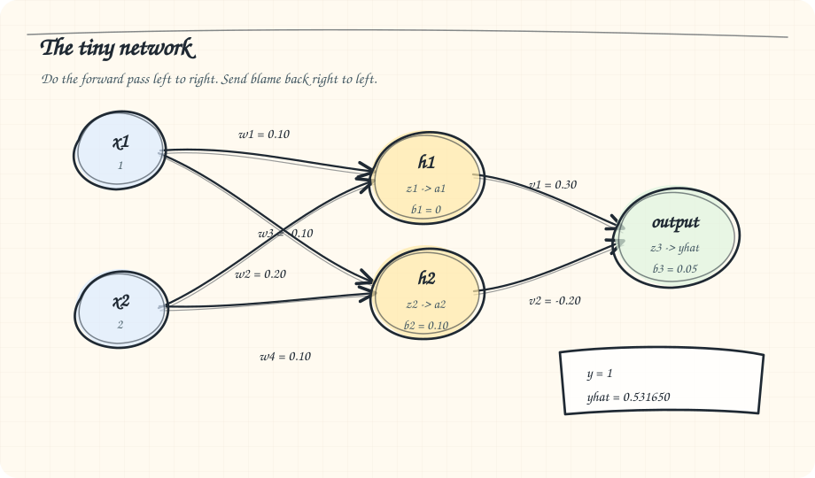
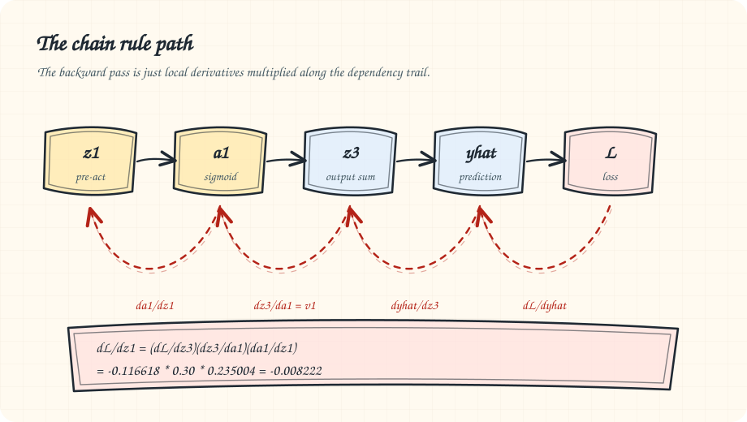
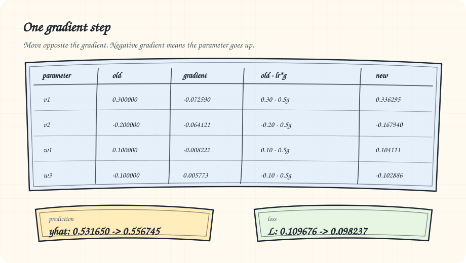

# Doing Back Propagation by Hand

Back propagation sounds like something invented to scare undergraduates and sell GPU clusters. It is not. It is just the chain rule with better accounting.

The problem is not that back propagation is mathematically hard. The problem is that it is usually introduced backwards. People show you a wall of matrix notation, sprinkle some deltas on top, and then expect you to feel enlightened. That is like explaining cooking by starting with restaurant logistics.

So let us do it by hand once.

No PyTorch. No TensorFlow. No "the optimizer handles it." Just a tiny neural network, one training example, and enough arithmetic to see what is actually moving.

## The network

We will use the smallest network that still feels like a neural network:

- Two inputs
- Two hidden neurons
- One output neuron
- Sigmoid activation everywhere
- Mean squared error loss

![[backprop-tiny-network.excalidraw]]

The training example is:

```text
x1 = 1
x2 = 2
target y = 1
```

The network looks like this:



We start with these weights:

```text
h1:
  w1 = 0.10
  w2 = 0.20
  b1 = 0.00

h2:
  w3 = -0.10
  w4 = 0.10
  b2 = 0.10

output:
  v1 = 0.30
  v2 = -0.20
  b3 = 0.05
```

The sigmoid function is:

```text
sigmoid(z) = 1 / (1 + exp(-z))
```

Its derivative is beautifully convenient:

```text
sigmoid'(z) = sigmoid(z)(1 - sigmoid(z))
```

That little fact is why old neural network textbooks were obsessed with sigmoid. It makes the derivative cheap once you already have the activation.

## First, go forward

Before the network can learn, it has to be wrong.

For the first hidden neuron:

```text
z1 = w1*x1 + w2*x2 + b1
z1 = 0.10*1 + 0.20*2 + 0.00
z1 = 0.50

a1 = sigmoid(0.50)
a1 = 0.622459
```

For the second hidden neuron:

```text
z2 = w3*x1 + w4*x2 + b2
z2 = -0.10*1 + 0.10*2 + 0.10
z2 = 0.20

a2 = sigmoid(0.20)
a2 = 0.549834
```

Now the output neuron:

```text
z3 = v1*a1 + v2*a2 + b3
z3 = 0.30*0.622459 + (-0.20)*0.549834 + 0.05
z3 = 0.126771

y_hat = sigmoid(0.126771)
y_hat = 0.531650
```

The network predicts `0.531650`. The target is `1`.

So the network is wrong by:

```text
y_hat - y = 0.531650 - 1
y_hat - y = -0.468350
```

We will use the half squared error:

```text
L = 0.5 * (y_hat - y)^2
L = 0.109676
```

The `0.5` is not philosophical. It is there because the derivative of a square creates a `2`, and the `0.5` cancels it. Mathematicians like cleanliness. Occasionally they deserve credit.

## What learning actually means

Learning means changing each weight in the direction that reduces the loss.

That is it.

Every weight asks the same question:

```text
If I move a little, what happens to the loss?
```

That question is a derivative:

```text
dL/dweight
```

If `dL/dweight` is positive, increasing the weight increases loss, so we should decrease it.

If `dL/dweight` is negative, increasing the weight decreases loss, so we should increase it.

The update rule is:

```text
new_weight = old_weight - learning_rate * gradient
```

We will use:

```text
learning_rate = 0.5
```

In compact notation:

$$
\theta_{\text{new}}=\theta_{\text{old}}-\eta \nabla_{\theta}L
$$

Yes, that is large. This is a toy example, not a production trading system.

## Now go backward

Back propagation starts at the loss and walks backward through the network.

The final output depends on `z3`. `z3` depends on `v1`, `v2`, `b3`, `a1`, and `a2`. The hidden activations depend on their own weights. The loss sits at the end of this chain.

So we apply the chain rule from the end back to the beginning.

Start with:

```text
L = 0.5 * (y_hat - y)^2
```

The derivative with respect to the prediction is:

```text
dL/dy_hat = y_hat - y
dL/dy_hat = -0.468350
```

The prediction came from a sigmoid:

```text
y_hat = sigmoid(z3)
```

So:

```text
dy_hat/dz3 = y_hat * (1 - y_hat)
dy_hat/dz3 = 0.531650 * (1 - 0.531650)
dy_hat/dz3 = 0.248998
```

Combine them:

```text
dL/dz3 = dL/dy_hat * dy_hat/dz3
dL/dz3 = -0.468350 * 0.248998
dL/dz3 = -0.116618
```

This value is often called the output delta:

```text
delta3 = -0.116618
```

The word "delta" makes it sound more profound than it is. It just means "the loss sensitivity at this neuron before activation."

## Update the output weights

The output pre-activation was:

```text
z3 = v1*a1 + v2*a2 + b3
```

So:

```text
dz3/dv1 = a1
dz3/dv2 = a2
dz3/db3 = 1
```

Therefore:

```text
dL/dv1 = dL/dz3 * dz3/dv1
dL/dv1 = delta3 * a1
dL/dv1 = -0.116618 * 0.622459
dL/dv1 = -0.072590
```

```text
dL/dv2 = delta3 * a2
dL/dv2 = -0.116618 * 0.549834
dL/dv2 = -0.064121
```

```text
dL/db3 = delta3
dL/db3 = -0.116618
```

All three gradients are negative. That means increasing these parameters will reduce the loss.

Now apply the update rule:

```text
new_v1 = 0.30 - 0.5*(-0.072590) = 0.336295
new_v2 = -0.20 - 0.5*(-0.064121) = -0.167940
new_b3 = 0.05 - 0.5*(-0.116618) = 0.108309
```

The output layer is done.

This is where most people think the difficult part begins. It does not. The hidden layer is the same idea with one extra link in the chain.

## Send blame backward

The hidden neurons affected the loss only through the output neuron.

That sentence is the whole point of back propagation.

The loss does not directly know what `w1` or `w2` are. It only knows the final prediction was too low. The output neuron then tells the hidden neurons how much they contributed to that mistake.

For hidden neuron `h1`, we need:

```text
dL/dz1
```

The chain is:

```text
z1 -> a1 -> z3 -> y_hat -> L
```



In LaTeX, the same path is:

$$
\frac{\partial L}{\partial z_1}
=
\frac{\partial L}{\partial z_3}
\frac{\partial z_3}{\partial a_1}
\frac{\partial a_1}{\partial z_1}
=
-0.116618 \cdot 0.30 \cdot 0.235004
=
-0.008222
$$

So:

```text
dL/dz1 = dL/dz3 * dz3/da1 * da1/dz1
```

We already know:

```text
dL/dz3 = delta3 = -0.116618
```

Since:

```text
z3 = v1*a1 + v2*a2 + b3
```

we get:

```text
dz3/da1 = v1 = 0.30
```

And:

```text
da1/dz1 = a1 * (1 - a1)
da1/dz1 = 0.622459 * (1 - 0.622459)
da1/dz1 = 0.235004
```

Therefore:

```text
dL/dz1 = -0.116618 * 0.30 * 0.235004
dL/dz1 = -0.008222
```

Call it:

```text
delta1 = -0.008222
```

Now do the same for `h2`:

```text
dL/dz2 = dL/dz3 * dz3/da2 * da2/dz2
```

Here:

```text
dz3/da2 = v2 = -0.20
```

and:

```text
da2/dz2 = a2 * (1 - a2)
da2/dz2 = 0.549834 * (1 - 0.549834)
da2/dz2 = 0.247517
```

So:

```text
dL/dz2 = -0.116618 * (-0.20) * 0.247517
dL/dz2 = 0.005773
```

Call it:

```text
delta2 = 0.005773
```

Notice the sign changed. That is not a typo. The second hidden neuron connects to the output with a negative weight. If `a2` goes up, `z3` goes down. Since the output was already too low, increasing `a2` makes the prediction worse. The gradient reflects that.

This is why back propagation matters. It does not simply say "make everything bigger because the prediction was too low." It assigns responsibility through the actual wiring of the network.

## Update the hidden weights

For `h1`:

```text
z1 = w1*x1 + w2*x2 + b1
```

So:

```text
dL/dw1 = delta1 * x1 = -0.008222 * 1 = -0.008222
dL/dw2 = delta1 * x2 = -0.008222 * 2 = -0.016443
dL/db1 = delta1 = -0.008222
```

Update:

```text
new_w1 = 0.10 - 0.5*(-0.008222) = 0.104111
new_w2 = 0.20 - 0.5*(-0.016443) = 0.208222
new_b1 = 0.00 - 0.5*(-0.008222) = 0.004111
```

For `h2`:

```text
z2 = w3*x1 + w4*x2 + b2
```

So:

```text
dL/dw3 = delta2 * x1 = 0.005773 * 1 = 0.005773
dL/dw4 = delta2 * x2 = 0.005773 * 2 = 0.011546
dL/db2 = delta2 = 0.005773
```

Update:

```text
new_w3 = -0.10 - 0.5*(0.005773) = -0.102886
new_w4 = 0.10 - 0.5*(0.011546) = 0.094227
new_b2 = 0.10 - 0.5*(0.005773) = 0.097114
```

And that is one full back propagation step.

## Did it work?

Let us run the network forward again with the new weights.

The prediction moves from:

```text
old y_hat = 0.531650
```

to:

```text
new y_hat = 0.556745
```

The target is `1`, so the prediction moved in the right direction.

The loss moves from:

```text
old loss = 0.109676
```

to:

```text
new loss = 0.098237
```



That is learning. No magic. No sentience. No tiny ghost in the GPU having opinions. Just a prediction, an error, and a disciplined way of distributing blame.

## The general pattern

Every neuron does the same three things.

First, during the forward pass:

```text
z = weighted input + bias
a = activation(z)
```

Then, during the backward pass, it receives a signal from the layer after it. That signal says:

```text
Here is how much the loss cares about your output.
```

The neuron multiplies that by the derivative of its activation:

```text
delta = incoming_error * activation_derivative
```

Then each incoming weight gets a gradient:

```text
gradient_for_weight = delta * input_that_used_that_weight
```

That is the whole machine.

Deep networks look more intimidating because they contain millions or billions of these operations. But the idea does not change. Back propagation is not a new kind of intelligence. It is the chain rule applied at industrial scale.

## Why doing it by hand matters

You do not need to do this by hand every day. That would be a waste of a good life.

But you should do it once.

Because after you do, neural networks stop looking like black boxes in the lazy sense. They may still be hard to interpret at scale, but they are not mystical. Each parameter is nudged according to how much it contributed to the final error. Each layer passes responsibility backward through the weights that connected it to the next layer.

The forward pass makes a claim.

The loss measures how wrong the claim was.

Back propagation computes who should be blamed.

Gradient descent applies the punishment.

That is the training loop.

The rest is scale, architecture, data, hardware, and a frightening amount of matrix multiplication. Important, yes. But conceptually downstream.

If you understand the tiny example above, you understand the central trick. Everything else is engineering.
